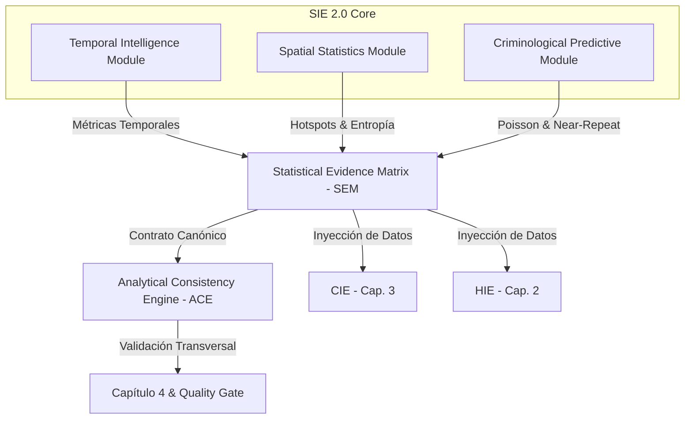
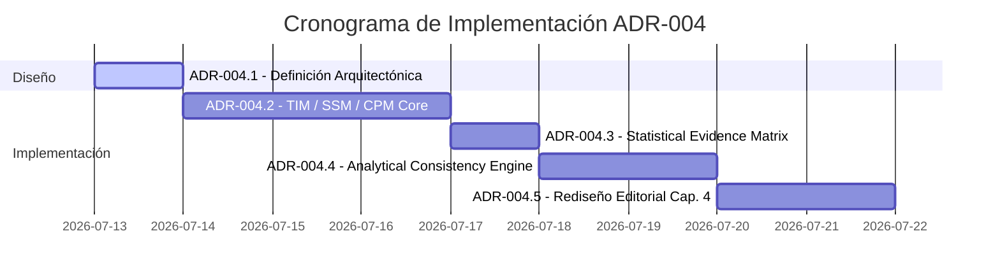

# ADR-004.1: DISEÑO ARQUITECTÓNICO DEL STATISTICAL INTELLIGENCE ENGINE 2.0
## SEM + ANALYTICAL CONSISTENCY ENGINE (Ecosistema SAI – CEIPOL)

---

## Estado del ADR
*   **Identificador**: `ADR-004.1`
*   **Título**: Diseño Arquitectónico Statistical Intelligence Engine 2.0
*   **Estado**: 🟡 Propuesto para implementación (Pendiente de Aprobación)
*   **Predecesor**: `ADR-004.0` (Auditoría profunda Capítulo 4)
*   **Relacionado con**: [ADR-001](file:///C:/Users/sadi7/OneDrive/Desktop/ECOSISTEMA%20SAI/PERFIL%20REMOTO/src/utils/territorialContextEngine.ts), [ADR-002](file:///C:/Users/sadi7/OneDrive/Desktop/ECOSISTEMA%20SAI/PERFIL%20REMOTO/src/utils/hypothesisIntelligenceEngine.ts), [ADR-003](file:///C:/Users/sadi7/OneDrive/Desktop/ECOSISTEMA%20SAI/PERFIL%20REMOTO/src/utils/cartographicIntelligenceEngine.ts), [ADR-003.2.1](file:///C:/Users/sadi7/OneDrive/Desktop/ECOSISTEMA%20SAI/PERFIL%20REMOTO/src/utils/reportQualityGate.ts)

---

## 1. Contexto y Problemas Identificados
El Capítulo 4 del Perfilador Remoto utiliza actualmente el **`StatisticalIntelligenceEngine` (SIE)** para procesar y analizar la dinámica temporal, la distribución espacial, los indicadores criminológicos y las proyecciones probabilísticas de los delitos en el cuadrante. 

La auditoría profunda del Capítulo 4 (`ADR-004.0`) determinó que el motor actual posee una base matemática sólida, pero presenta serias limitaciones de diseño e integración:

1.  **Fragmentación y Aislamiento**: El SIE opera en silos. No comparte información con el motor territorial (**TCE**), el motor de hipótesis (**HIE**) o el motor cartográfico (**CIE**).
2.  **Discrepancias Intercapítulos**: La falta de un contrato común causa que diferentes capítulos del reporte muestren inconsistencias estadísticas, resolviendo variables y clústeres de forma divergente.
3.  **Debilidad Predictiva**: La estimación de riesgo se basa exclusivamente en un modelo de Poisson lineal simplificado que asume una tasa constante delictiva, ignorando la estacionalidad y el contagio criminológico de repetición cercana (*Near-Repeat*).
4.  **Ausencia de Gobernanza**: No existe ningún componente en la arquitectura que verifique de manera automática la coherencia criminal, espacial e hipotética entre motores antes de consolidar el reporte.

---

## 2. Decisión Arquitectónica
Se decide evolucionar la estructura del motor estadístico a la versión **Statistical Intelligence Engine 2.0 (SIE 2.0)**. Esta evolución constará de cinco componentes principales:



---

## 3. Principios Rectores

> [!IMPORTANT]
> ### 3.1 Determinismo Matemático
> Todos los cálculos numéricos de tendencias, clústeres y probabilidades se ejecutarán del lado del servidor. Serán 100% reproducibles, auditables y libres de alucinaciones.

> [!NOTE]
> ### 3.2 Separación Estricta Cálculo / Interpretación
> El motor **SIE 2.0 calcula las estadísticas**; el LLM **(Gemini 1.5 Pro) interpreta los patrones**. Queda terminantemente prohibido que Gemini calcule números, altere porcentajes o infiera variables cuantitativas fuera de la matriz oficial.

> [!IMPORTANT]
> ### 3.3 Fuente Canónica Única
> Todos los módulos analíticos (TIM, SSM, CPM) consumirán exclusivamente el arreglo estructurado `historicalIncidents` inyectado durante el bloqueo de variables en el cliente.

> [!TIP]
> ### 3.4 Trazabilidad de Métricas
> Cada registro o conclusión generada por el SIE 2.0 incluirá metadatos de auditoría: versión del motor analítico, origen del dato de entrada y estampa de tiempo.

---

## 4. Nueva Arquitectura SIE 2.0 (Desglose de Módulos)

### Módulo 1: Temporal Intelligence Module (TIM)
*   **Objetivo**: Analizar la dinámica cronológica, tendencias y estacionalidades.
*   **Métodos**:
    *   `analyzeSeasonality(records)`: Calcula coeficientes de variación temporal diarios y por turnos.
    *   `calculateTrend(records)`: Aplica el método robusto de regresión de *Theil-Sen* para estimar la pendiente y dirección de la incidencia sin ser afectado por picos aislados.
    *   `detectTemporalAnomalies(records)`: Identifica desviaciones estándar que superen el límite $\mu + 2\sigma$.
    *   `calculateAccelerationIndex(records)`: Determina el índice de aceleración criminal comparando períodos.
*   **Variables de Salida**:
    ```typescript
    interface TemporalEvidence {
      monthlyDistribution: number[];
      weeklyDistribution: number[];
      hourlyDistribution: number[];
      seasonalityIndex: number; // Coeficiente de variación temporal
      accelerationIndex: number; // Variación entre mitades de tiempo
      anomalies: { fecha: string; volumen: number }[];
    }
    ```

### Módulo 2: Spatial Statistics Module (SSM)
*   **Objetivo**: Sustituir el grid rústico de redondeo de coordenadas por modelos espaciales robustos.
*   **Métodos**:
    *   `dbscanCluster(records, epsMeters, minPoints)`: Implementa la segmentación de densidad espacial DBSCAN usando distancias de Haversine:
        $$N_{\epsilon}(p) = \{q \in D \mid \text{dist}_{\text{Haversine}}(p, q) \le \epsilon\}$$
    *   `calculateSpatialEntropy(records)`: Mide la homogeneidad del patrón espacial del delito (Shannon Entropy espacial).
    *   `calculateSpatialDispersion(records)`: Calcula la desviación estándar espacial (Standard Distance) real en metros.
    *   `calculateHotspots(records)`: Extrae los baricentros de los clústeres más densos.
*   **Variables de Salida**:
    ```typescript
    interface SpatialEvidence {
      clusters: { id: string; lat: number; lng: number; count: number }[];
      hotspots: { lat: number; lng: number; weight: number }[];
      densityScore: number; // Concentración relativa al área total
      spatialEntropy: number; // 0-1 (Shannon Entropy)
      dispersionMeters: number; // Standard Distance
    }
    ```

### Módulo 3: Criminological Predictive Module (CPM)
*   **Objetivo**: Proyectar escenarios futuros basándose en la proximidad temporal y el contagio espacial.
*   **Métodos**:
    *   `calculateNearRepeatRisk(records, targetLat, targetLng)`: Evalúa el riesgo de repetición delictiva en función del tiempo y la distancia al último evento registrado.
    *   `calculateGoodnessOfFit(records)`: Aplica la prueba de Chi-cuadrada ($\chi^2$) de bondad de ajuste para validar la distribución de Poisson del set de datos:
        $$\chi^2 = \sum \frac{(O_i - E_i)^2}{E_i}$$
*   **Variables de Salida**:
    ```typescript
    interface PredictiveEvidence {
      poissonWeeklyProbability: number;
      nearRepeatRiskScore: number; // Basado en contagio criminológico
      modelFitScore: number; // Valor p del test Chi-Cuadrado
      confidenceLevel: number; // Confiabilidad porcentual ajustada
    }
    ```

---

## 5. Statistical Evidence Matrix (SEM)
La **Statistical Evidence Matrix (SEM)** se establece como el contrato de datos institucional unificado de salida del SIE 2.0:

```typescript
export interface StatisticalEvidenceMatrix {
  meta: {
    projectId: string;
    totalCanonicalIncidents: number;
    analysisRadiusMeters: number;
  };
  temporalEvidence: {
    trend: 'INCREMENTO' | 'ESTABLE' | 'DECREMENTO';
    trendSlope: number;
    seasonalityIndex: number;
    anomalies: { date: string; count: number }[];
  };
  spatialEvidence: {
    centerOfGravity: { lat: number; lng: number };
    dispersionMeters: number;
    hotspots: { lat: number; lng: number; intensity: number }[];
  };
  predictiveEvidence: {
    poissonProbability: number;
    nearRepeatRisk: number; // 0-100
    modelFit: number; // Chi-Square p-value
    confidence: number; // Score final de certeza
  };
  traceability: {
    source: string;
    engineVersion: string;
    generatedAt: string;
  };
}
```

---

## 6. Analytical Consistency Engine (ACE)
El **ACE** es el nuevo validador transversal de coherencia del Ecosistema SAI, encargado de asegurar que la narrativa generada por los motores analíticos no se contradiga.

### Reglas de Validación del ACE

```typescript
export interface ConsistencyResult {
  status: 'VALIDATED' | 'CONFLICT' | 'WARNING';
  warnings: string[];
  conflicts: string[];
}
```

1.  **Consistencia de Base Criminal**:
    $$\text{TCE.totalIncidents} == \text{SIE.totalCanonicalIncidents} == \text{CIE.totalEvents}$$
    *Falla*: Lanza un error crítico de bloqueo (`CONFLICT`).
2.  **Consistencia Geoespacial**:
    El centro de gravedad calculado por el SIE 2.0 debe coincidir con el baricentro analizado en el CIE. La distancia entre ambos centros de gravedad no debe superar el 10% del radio de análisis:
    $$\text{dist}_{\text{Haversine}}(\text{CG}_{\text{SIE}}, \text{CG}_{\text{CIE}}) \le \text{Radio} \times 0.10$$
    *Falla*: Genera un `WARNING` de calibración espacial.
3.  **Consistencia Criminológica-Hipótesis**:
    Si el motor HIE formula una hipótesis de **oportunidad ambiental** debido a facilitadores físicos (como falta de luz o maleza), el SIE 2.0 debe corroborarlo mostrando una alta concentración en el **horario crítico nocturno** (dentro de la ventana de oportunidad).
    *Falla*: Genera un `WARNING` en la matriz de trazabilidad.

---

## 7. Cambios Metodológicos en el Capítulo 4
El Capítulo 4 dejará de ser una descripción lineal de estadísticas para convertirse en un análisis estructurado bajo el siguiente flujo lógico:

```
[Evidencia Estadística (SEM)]
            │
            ▼
[Patrón Identificado (TIM/SSM)]
            │
            ▼
[Inferencia Criminológica]
            │
            ▼
[Hipótesis Operacional y Acciones]
```

---

## 8. Restricciones de Implementación
*   **ADR-004.1**: Define **únicamente el diseño arquitectónico**.
*   **Código Protegido**: No se modificará el `statisticalIntelligenceEngine.ts` actual, los controladores de generación de PDF/Word, ni la API `generate-profile` hasta la fase de ejecución.

---

## 9. Ruta de Implementación Futura


