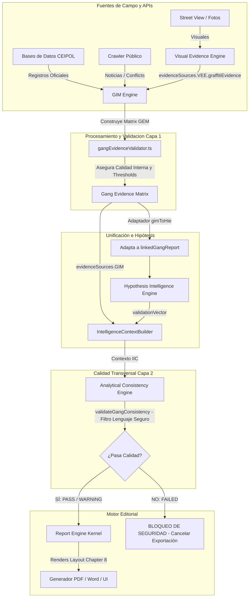

# ADR-008.1.1: Auditoría Técnica de Compatibilidad Arquitectónica
## Integración del Gang Intelligence Module (GIM) — Perfilador CEIPOL

---

## 1. Resumen Ejecutivo

Este documento constituye el dictamen formal de la **Auditoría Técnica de Compatibilidad Arquitectónica (ADR-008.1.1)** para la incorporación del **Gang Intelligence Module (GIM)** dentro del Perfilador CEIPOL.

El objetivo principal es evaluar el diseño preliminar del **ADR-008.1** contrastándolo directamente contra la base de código real del proyecto, garantizando que el nuevo flujo analítico no altere los contratos vigentes, evite duplicidades funcionales, erradique la posibilidad de alucinaciones criminalizantes y mantenga la inmutabilidad y robustez del **IntelligenceIntegrationContext (IIC)** como única fuente de verdad certificada.

### Estatus de la Auditoría:
🟢 **COMPATIBLE CON AJUSTES OBLIGATORIOS**  
La integración del GIM es perfectamente viable y la arquitectura actual cuenta con preparaciones preliminares que simplifican el acoplamiento. Sin embargo, para cumplir con las rigurosas políticas de gobernanza de datos de CEIPOL, se requiere implementar un patrón de validación en dos capas (Layered Validation) y un adaptador de retrocompatibilidad con el motor de hipótesis.

---

## 2. Arquitectura Actual Detectada (Línea de Base)

A través de la inspección estricta de la estructura de archivos en `src/`, se identificaron los límites de integración del sistema:

*   **Contrato Unificado:** `src/utils/intelligenceIntegrationContract/` administra el modelo inmutable `IntelligenceIntegrationContext` (IIC), definiendo el estatus de capacidades del cuadrante y actuando como barrera de compilación frente al legado.
*   **Análisis Visual:** `src/utils/visualEvidenceEngine/` captura, procesa y etiqueta imágenes (incluyendo detección de grafitis en el archivo independiente `graffitiDetector.ts`).
*   **Motor de Hipótesis (HIE):** El archivo `src/utils/hypothesisIntelligenceEngine.ts` opera de forma centralizada calculando un puntaje de certidumbre científica (0-100) y derivando explicaciones narrativas estructuradas.
*   **Consistencia Analítica (ACE):** El directorio `src/utils/analyticalConsistencyEngine/` ejecuta un auditor de calidad cruzada transversal que puede vetar la exportación del reporte.
*   **Maquetación Editorial:** `src/utils/intelligenceLayoutEngine.ts` estructura el informe oficial en un formato estricto de 12 páginas, donde el **CAPÍTULO 8: ACTORES TERRITORIALES Y PANDILLAS** ya se encuentra pre-reservado y acoplado mediante la propiedad `payload.pandillasAnalysis`.

---

## 3. Auditoría IIC (Fase 1)

### Análisis de Integración de Módulos Anteriores (HIE, ACE, VEE, TIE)
Los módulos analíticos previos siguen un patrón unificado de tres niveles:
1.  **Registro de Capacidad:** Se declaran propiedades booleanas en `models/intelligenceContextTypes.ts` bajo la interfaz `CapabilityStatus` e `IntelligenceModules`.
2.  **Evaluación Estructurada:** El orquestador `CapabilityRegistry.ts` analiza la presencia de datos válidos (ej: `totalEvents > 0` para estadística; presencia de fotos para visuales) y computa dinámicamente el estatus del módulo para prevenir excepciones o referencias a propiedades inexistentes durante la maquetación.
3.  **Encapsulación de Evidencia (`evidenceSources`):** Se añade el modelo canónico al objeto IIC inmutable administrado por `IntelligenceContextBuilder.ts`.

### Determinación para el GIM
El GIM **debe integrarse bajo la combinación de los tres mecanismos**:

*   **Como `evidenceSource`:** `evidenceSources.GIM` typed as `GangEvidenceMatrix | null`. Esto garantiza que los datos estructurados estén disponibles formalmente para cualquier exportador o motor de auditoría posterior.
*   **Como `intelligenceModule`:** Activando la bandera pre-existente `intelligenceModules.gang = true` dentro del builder para declarar activo el procesamiento.
*   **Como `capabilityStatus`:** Modificando `CapabilityRegistry.getCapabilityStatus` para retornar `gangIntelligence: !!gim && (gim.presenceEvidence.status !== "NO_EVIDENCE" || gim.osintEvidence.eventsFound > 0)`.

**Justificación Técnica:** Este enfoque de triple registro es el único que respeta el principio de "Cero bypass legacy" certificado en el ADR-007.4. Permite que el Report Engine determine de forma segura y determinista si debe inyectar datos del GIM en el diseño sin riesgo de fallas por propiedades nulas o indefinidas.

---

## 4. Auditoría Visual Evidence Engine (Fase 2)

### Hallazgos de Inspección en `src/utils/visualEvidenceEngine/`
*   **Almacenamiento de Evidencias:** Las imágenes se representan bajo la interfaz `VisualEvidenceInternal` con propiedades como `id`, `source` (`ANALYST | STREET_VIEW`), `category` y `observation`.
*   **Clasificación y Detección de Grafitis:** Se localizó el archivo independiente `graffitiDetector.ts`. Este componente filtra evidencias buscando términos como `"grafiti"`, `"graffiti"`, `"rayone"`, o `"pinta"` en el comentario del analista, o verificando si la categoría es `"GRAFITI_TERRITORIAL"`.
*   **Asignación de Confianza:** Asigna automáticamente nivel `"HIGH"` si proviene de un analista físico, y `"MEDIUM"` si proviene de imágenes automatizadas de Street View.

### Recomendación de Arquitectura de Consumo
> [!CAUTION]
> **Prohibición de Duplicidad Funcional:** El GIM NO debe crear su propio detector o analizador de imágenes en bruto, ni realizar búsquedas paralelas de archivos.

**Flujo Recomendado:**
1.  El **VEE** procesa las fotos y compila la matriz visual, depositando los grafitis identificados en `evidenceSources.VEE.graffitiEvidence`.
2.  El **GIM** actúa como un consumidor de segundo nivel: recibe el array de grafitis ya filtrados por el VEE y ejecuta la correlación simbólica y territorial de nivel de inteligencia (ej. cruzar las coordenadas de los grafitis del VEE con menciones de pandillas u OSINT).

```
VEE (Filtro e Identificación Física de Grafiti)
       │
       ▼ (graffitiEvidence)
IIC Unified Context
       │
       ▼ (Consumo de Datos Visuales)
GIM (Análisis Simbólico, Territorial e Histórico de Pandillas)
```

---

## 5. Auditoría Hypothesis Intelligence Engine (Fase 3)

### Hallazgos de Inspección en `src/utils/hypothesisIntelligenceEngine.ts`
El motor HIE calcula un puntaje general de certidumbre combinando 5 pesos específicos de evidencia: Territorial (10 pts), Criminal-SIE (35 pts), Ambiental (25 pts), Urbana (15 pts) y OSINT (15 pts).

*   **Consumo de Actores:** El HIE ya tiene programada una lectura de actores territoriales en las líneas 284-295:
    ```typescript
    const linkedGangReport = rawInput.linkedGangReport || tce.linkedGangReport || null;
    if (linkedGangReport && Array.isArray(linkedGangReport.matched_gangs) && linkedGangReport.matched_gangs.length > 0) {
      // Agrega 5 puntos de peso y registra la evidencia en HIE.
    }
    ```
*   **Manejo de Contradicciones:** Si existe un reporte pero no se identifican pandillas, añade una inconsistencia formal a `contradictoryEvidence`.

### Recomendación de Compatibilidad
Para evitar romper la lógica interna de cálculo del HIE y mantener retrocompatibilidad:
1.  **Patrón Adaptador:** El GIM debe proveer un adaptador ligero (`gimToHieAdapter.ts`) que traduzca las variables de la nueva `GangEvidenceMatrix` (GEM) al formato clásico esperado de `linkedGangReport` (por ejemplo, mapeando `presenceEvidence` y `territorialInfluence` a un arreglo plano de `matched_gangs`).
2.  **Inyección en HIE:** Se inyectará el resultado adaptado en `rawInput.linkedGangReport` antes de ejecutar `HypothesisIntelligenceEngine.build()`. Esto garantiza compatibilidad del 100% sin alterar las complejas fórmulas matemáticas de peso y certidumbre del HIE actual.

---

## 6. Auditoría Analytical Consistency Engine (Fase 4)

### Hallazgos de Inspección en `src/utils/analyticalConsistencyEngine/`
*   **Componentes de Auditoría:** `ConsistencyValidators` posee métodos independientes para validaciones cuantitativas, espaciales, temporales, criminológicas y documentales.
*   **Control de Calidad Transversal:** Si el auditor detecta una falla crítica (como desviaciones del radio superiores al 10%), marca el reporte con estatus `"FAILED"` e inyecta un objeto descriptivo en `blockingReason`. Esto gatilla un bloqueo duro en la máquina de estados del kernel del Report Engine.

### Recomendación de Integración para el Validador GIM
El `gangEvidenceValidator.ts` propuesto en el diseño preliminar debe operar bajo un esquema de **Validación en Dos Capas (Layered Validation)**:

```
[ Capa 1: Validación Interna (GIM) ]
Foco: Datos, confianza local y límites metodológicos del dataset de pandillas.
Ocurre en: gangEvidenceValidator.ts (Dentro de GIM).
Consecuencia: Reduce confianza local a READY_WITH_LIMITATIONS.

                   │
                   ▼ (Matriz GEM aprobada internamente)
[ Capa 2: Validación Transversal (ACE) ]
Foco: Gobernanza institucional y consistencia trans-módulo.
Ocurre en: src/utils/analyticalConsistencyEngine/ (Extensión de ACE).
Consecuencia: Veta el informe completo (FAILED) si detecta lenguaje prohibido.
```

1.  **Capa de Validación Local (Independiente):** `gangEvidenceValidator.ts` se ejecuta localmente dentro de la carpeta del GIM para analizar la coherencia interna de los datos, calcular el nivel de confianza de la matriz (`confidence < 40`) y poblar automáticamente las advertencias metodológicas del módulo.
2.  **Capa de Validación Institucional (Integrada en ACE):** Se debe extender `ConsistencyValidators.ts` con un método específico: `validateGangConsistency()`. Este validador transversal inspeccionará mediante expresiones regulares la narrativa final de pandillas, y si detecta términos criminalizantes prohibidos (*"zona controlada por"*, *"miembro criminal confirmado"*), catalogará la alerta como `CRIMINOLOGICAL` de severidad `HIGH`, degradando el estatus global de ACE a `FAILED` para bloquear físicamente la exportación del reporte.

**Justificación Técnica:** Este diseño evita sobrecargar el módulo ACE con lógicas específicas de georreferenciación de pandillas, pero le otorga la potestad absoluta de veto para velar por los derechos humanos y las reglas éticas de la corporación.

---

## 7. Auditoría Report Engine (Fase 5)

### Consumo de Evidencia en el Motor Editorial
*   **Estructuración Editorial:** El `intelligenceLayoutEngine.ts` ya tiene pre-maquetado el diseño estricto de 12 páginas.
*   **Páginas Reales Acopladas:** 
    *   La página del Capítulo 8 (**CAPÍTULO 8: ACTORES TERRITORIALES Y PANDILLAS**, Línea 1125) ya se encuentra construida y consume directamente la propiedad `payload.pandillasAnalysis`.
    *   Si no hay menciones, el motor aplica de manera segura una narrativa predeterminada de no-presencia.
*   **Exportación de Word y PDF:** `exportToWord.ts` recibe el `editorialPayload` completo (el cual ya incluye a nivel de raíz el objeto `intelligenceContext` con todas las matrices de evidencia unificadas).

### Propuesta de Ubicación Conceptual e Integración
*   **Ubicación de la Narrativa:** El texto formateado en 4 partes (HALLAZGO, EVIDENCIA, ANÁLISIS, IMPLICACIÓN OPERATIVA) generado por Gemini a partir del IIC del GIM se asignará a `payload.pandillasAnalysis`, ocupando la página 9 del reporte institucional.
*   **Ubicación de Métricas Certificadas:** Las métricas de la GEM (cantidad de grafitis asociados en el polígono, eventos OSINT catalogados) se incorporarán dinámicamente en la sección de control de procedencia y trazabilidad analítica de la última página (Page 11, Tabla de Trazabilidad), y en la página de consistencia analítica ACE (Page 3) en caso de que existan observaciones metodológicas.

---

## 8. Matriz de Impacto Arquitectónico (Fase 6)

| Archivo / Componente / Módulo | Impacto | Tipo de Cambio Requerido | Justificación / Descripción del Cambio |
| :--- | :---: | :--- | :--- |
| **`models/intelligenceContextTypes.ts`** | **Medio** | Interface | Añadir `GIM: GangEvidenceMatrix \| null` bajo `evidenceSources`. Las propiedades de capacidad (`gangIntelligence` y `gang`) ya se encuentran pre-declaradas y no requieren cambios estructurales. |
| **`capabilityRegistry.ts`** | **Medio** | Registro | Modificar `getCapabilityStatus` para calcular dinámicamente la activación de la capacidad `gangIntelligence` en función de la presencia de datos reales en la GEM. |
| **`intelligenceContextBuilder.ts`** | **Medio** | Registro | Actualizar el método `build` para que acepte la `GangEvidenceMatrix` (GEM) como argumento de entrada y la consolide en el contexto unificado. |
| **`visualEvidenceEngine/`** | **Bajo** | Ninguno (Consumo) | El GIM consumirá de forma pasiva la propiedad `graffitiEvidence` de la matriz visual del VEE. No se altera el código del VEE. |
| **`hypothesisIntelligenceEngine.ts`** | **Medio** | Adaptador | Crear un adaptador de compatibilidad (`gimToHieAdapter.ts`) que traduzca los datos estructurados de la GEM al contrato legacy `linkedGangReport` que ya consume el HIE. |
| **`analyticalConsistencyEngine/`** | **Medio** | Validación | Extender `ConsistencyValidators.ts` con el validador cruzado `validateGangConsistency` para auditar lenguaje seguro y veto institucional. |
| **`reportEngine.ts`** | **Bajo** | Integración | Mapear la matriz GEM del IIC al payload editorial para consumo de los exportadores de Word/PDF. |
| **`intelligenceLayoutEngine.ts`** | **Bajo** | Integración | Asignar la narrativa estructurada de pandillas a la propiedad existente `payload.pandillasAnalysis` en el maquetador de páginas. |

---

## 9. Detección de Riesgos (Fase 7)

### Risk 1: Generación de Conclusiones Criminalizantes por Alucinación del LLM
*   **Clasificación:** 🚨 **CRÍTICO**
*   **Descripción:** A pesar de que las bases de datos de GIM estén estructuradas, la IA generativa (Gemini) podría alucinar afirmaciones categóricas de control territorial en la narrativa del Capítulo 8.
*   **Mitigación:** Aplicar la **Validación en Dos Capas**. El validador institucional de ACE inspeccionará mediante expresiones regulares la salida de texto de Gemini en busca de términos prohibidos y bloqueará físicamente la exportación del reporte si detecta infracciones.

### Risk 2: Ruptura de Contratos de Compilación (Null Pointer Exceptions)
*   **Clasificación:** ⚠️ **ALTO**
*   **Descripción:** Si un proyecto histórico carece de datos del GIM o es un reporte antiguo, la ausencia de la propiedad `GIM` en el IIC unificado de la base de datos podría provocar fallas de ejecución o errores en tiempo de maquetación.
*   **Mitigación:** Definir la propiedad `GIM` como nullable (`GangEvidenceMatrix | null`) y asegurar que el `CapabilityRegistry` asigne `false` de forma predeterminada ante datos nulos o vacíos.

### Risk 3: Duplicidad Funcional en Procesamiento de Imágenes
*   **Clasificación:** 🟢 **MEDIO**
*   **Descripción:** Riesgo de que el GIM intente implementar lógica redundante de detección de imágenes o clasificación visual de grafitis en campo, duplicando el código y los recursos consumidos por el `VisualEvidenceEngine`.
*   **Mitigación:** Desacoplamiento estricto: VEE es el único procesador visual y clasificador; GIM es un consumidor de segundo nivel que analiza la simbología territorial a partir de los grafitis identificados por VEE.

### Risk 4: Desalineación Geográfica de Eventos de Pandillas
*   **Clasificación:** 🟢 **MEDIO**
*   **Descripción:** Que se registren o citen eventos OSINT de pandillas que se sitúen fuera del radio de amortiguamiento táctico del proyecto (TCE), sesgando el análisis.
*   **Mitigación:** El validador interno de GIM debe auditar la distancia de Haversine de los eventos OSINT frente al centroide del proyecto, descartando o alertando sobre registros que superen el límite perimetral.

---

## 10. Arquitectura Objetivo Conceptual (Fase 8)

El siguiente diagrama de flujo describe la arquitectura y secuencia recomendada para la integración del GIM sin colisiones:



---

## 11. Dictamen Final (Fase 9)

### Estatus del Dictamen:
**`[ X ] APROBADO CON AJUSTES`**

Se certifica la compatibilidad técnica del diseño GIM con la arquitectura actual del Perfilador CEIPOL. No obstante, para proceder de manera segura con el desarrollo físico del ADR-008.1, se deben observar e implementar los siguientes ajustes obligatorios en el diseño antes del despliegue físico del código:

### Ajustes Obligatorios Previos a la Programación:
1.  **Validación Layered (Dos Capas):** Separar las lógicas de validación. `gangEvidenceValidator.ts` validará de forma aislada la consistencia de los datos internos, y el motor central de consistencia analítica (`ConsistencyValidators.ts` de ACE) se extenderá para validar el lenguaje ético/seguro del texto generado por Gemini, teniendo poder de veto transversal.
2.  **Arquitectura de Consumo Pasivo del VEE:** El analizador de grafitis de GIM (`graffitiTerritorialAnalyzer.ts`) consumirá directamente el array `evidenceSources.VEE.graffitiEvidence` unificado en el IIC, eliminando cualquier lógica redundante de procesamiento fotográfico o filtrado de base de datos visual en GIM.
3.  **Acoplamiento HIE por Adaptador:** Implementar el adaptador de compatibilidad para transformar la estructura de datos GEM en la interfaz `linkedGangReport` clásica, salvaguardando la inmutabilidad de los cálculos matemáticos del HIE.

---

### Planificación del Orden de Implementación Física:

Para minimizar el riesgo de regresiones o roturas en compilación, se prescribe el siguiente orden secuencial de desarrollo:

```
PASO 1: Contratos y Modelos (Models & Interfaces)
        Definir gangIntelligenceTypes.ts y actualizar models/intelligenceContextTypes.ts.
                      │
                      ▼
PASO 2: Procesadores Internos (GIM Analyzers)
        Escribir graffitiTerritorialAnalyzer.ts y gangOsintAnalyzer.ts (Consumiendo VEE).
                      │
                      ▼
PASO 3: Validación Local (Capa 1)
        Construir gangEvidenceValidator.ts para thresholds locales y limitaciones de GEM.
                      │
                      ▼
PASO 4: Unificación e Integración IIC
        Actualizar CapabilityRegistry.ts e IntelligenceContextBuilder.ts para integrar GEM.
                      │
                      ▼
PASO 5: Adaptación y Consistencia Transversal (Capa 2)
        Programar gimToHieAdapter.ts y extender ConsistencyValidators.ts (validateGangConsistency).
                      │
                      ▼
PASO 6: Suite de Pruebas Unitarias
        Codificar tests/gangIntelligence.test.ts con los 5 casos obligatorios de control.
                      │
                      ▼
PASO 7: Integración en el Orquestador de API y Layout
        Actualizar route.ts de generate-profile e inyectar narrativa a payload.pandillasAnalysis.
```

---
*Fin del Dictamen de Auditoría Arquitectónica ADR-008.1.1*
