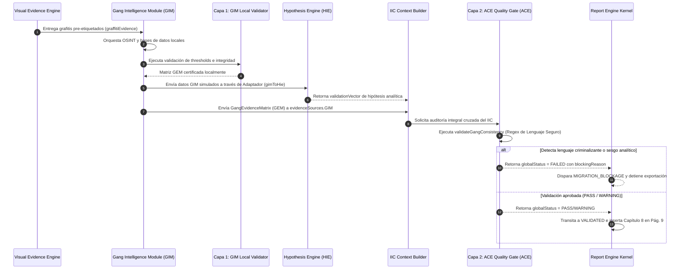

# ADR-008.2: ACTUALIZACIÓN DEL DISEÑO ARQUITECTÓNICO DEL GANG INTELLIGENCE MODULE (GIM)
## Derivado de Auditoría Técnica de Compatibilidad ADR-008.1.1

---

## 1. Estado del ADR
*   **Identificador:** `ADR-008.2`
*   **Título:** Actualización del Diseño Arquitectónico del Gang Intelligence Module (GIM) Derivada de Auditoría Técnica ADR-008.1.1
*   **Estado:** 🟢 **APROBADO PARA IMPLEMENTACIÓN**  
    Los criterios de aceptación funcional establecidos en esta actualización constituyen la línea base de validación previa al desarrollo físico.
*   **Ecosistema:** Perfilador CEIPOL (SSPE - Aguascalientes)
*   **Fecha de Publicación:** 14 de Julio, 2026


---

## 2. Referencias Arquitectónicas
*   **Predecesor Directo:** [ADR-008.1](file:///C:/Users/sadi7/OneDrive/Desktop/ECOSISTEMA%20SAI/PERFIL%20REMOTO/implementation_design_adr_008_1.md) (Diseño del Gang Intelligence Module - GIM)
*   **Auditoría de Origen:** [ADR-008.1.1](file:///C:/Users/sadi7/OneDrive/Desktop/ECOSISTEMA%20SAI/PERFIL%20REMOTO/adr_008_1_1_auditoria_integracion_gim.md) (Auditoría Técnica de Compatibilidad GIM)
*   **Contratos Relacionados:** 
    *   [ADR-007.3 & ADR-007.4](file:///C:/Users/sadi7/OneDrive/Desktop/ECOSISTEMA%20SAI/PERFIL%20REMOTO/adr_007_4_auditoria_iic.md) (Intelligence Integration Contract - IIC)
    *   [ADR-005.4](file:///C:/Users/sadi7/OneDrive/Desktop/ECOSISTEMA%20SAI/PERFIL%20REMOTO/src/utils/visualEvidenceEngine) (Visual Evidence Engine - VEE)
    *   [HIE](file:///C:/Users/sadi7/OneDrive/Desktop/ECOSISTEMA%20SAI/PERFIL%20REMOTO/src/utils/hypothesisIntelligenceEngine.ts) (Hypothesis Intelligence Engine)
    *   [ACE](file:///C:/Users/sadi7/OneDrive/Desktop/ECOSISTEMA%20SAI/PERFIL%20REMOTO/src/utils/analyticalConsistencyEngine/) (Analytical Consistency Engine)

---

## 3. Cambios Críticos respecto al ADR-008.1

Derivado de la auditoría de compatibilidad `ADR-008.1.1`, se determinó que el diseño original presentaba áreas de acoplamiento estrecho y duplicidades funcionales que podían vulnerar los contratos unificados. Se adoptan los siguientes cambios estructurales obligatorios:

1.  **Redefinición de Responsabilidades:** Se despoja al GIM de toda capacidad de procesamiento visual directo. El GIM pasa a ser un motor de interpretación de segundo nivel que consume evidencias visuales pre-etiquetadas por el VEE.
2.  **Triple Acoplamiento IIC:** Se formaliza la inyección del módulo en tres capas simultáneas del IIC (evidencia, módulo y capacidad) para asegurar que el motor editorial y las capas de exportación operen bajo el esquema inmutable del ADR-007.3.
3.  **Abstracción del Motor de Hipótesis (HIE):** Se establece la inmutabilidad matemática del HIE. La compatibilidad se resuelve en un adaptador aislado (`gimToHieAdapter.ts`) que mapea la matriz GIM al contrato legacy `linkedGangReport`.
4.  **Modelo de Validación Dual (Layered Validation):** El validador local de GIM se limita a la calidad del dato y límites perimetrales. ACE asume de forma centralizada la auditoría narrativa, la detección de sesgos y la potestad de bloqueo y veto del informe.
5.  **Incorporación del Libro de Trazabilidad:** Se añade el componente conceptual `gimEvidenceTraceability.ts` para proveer un registro de auditoría de procedencia de cada dato inyectado, fortaleciendo el carácter científico-legal del dictamen.

---

## 4. Nueva Arquitectura Conceptual GIM (Estructura de Archivos)

La estructura conceptual se actualiza para alojar los módulos de forma estrictamente desacoplada dentro de `src/utils/gangIntelligenceEngine/`:

```
src/utils/gangIntelligenceEngine/
│
├── models/
│    └── gangIntelligenceTypes.ts         # Contratos de tipos y esquemas TypeScript
│
├── gangIntelligenceEngine.ts             # Fachada de orquestación y procesamiento de GIM
│
├── gangEvidenceBuilder.ts                # Constructor analítico de la GangEvidenceMatrix
│
├── gangEvidenceValidator.ts              # Validador local (Capa 1: Coherencia interna, thresholds, límites)
│
├── gangOsintAnalyzer.ts                  # Parser de riñas, conflictos y barridos OSINT perimetrales
│
├── graffitiTerritorialAnalyzer.ts        # Analizador de compatibilidad simbólica (Consume de VEE)
│
├── gimEvidenceTraceability.ts            # Libro de Trazabilidad e Historial de Procedencia
│
├── adapters/
│    └── gimToHieAdapter.ts               # Adaptador para retrocompatibilidad con el HIE
│
├── index.ts                              # Exportaciones públicas de la API del módulo
│
└── tests/
     └── gangIntelligence.test.ts         # Suite de pruebas unitarias (5 casos de control actualizados)
```

> [!IMPORTANT]
> ### 4.1 Aclaración Operativa de `graffitiTerritorialAnalyzer.ts`
> Este archivo NO realiza llamadas a Google Vision, no interactúa con buffers de imagen, ni analiza archivos Base64. Su función se limita a consumir el array `graffitiEvidence` ya procesado e inyectado por el **Visual Evidence Engine (VEE)** en el IIC, ejecutando reglas lógicas y cruces de texto sobre los metadatos de las observaciones visuales.

---

## 5. Integración con el Intelligence Integration Contract (IIC)

Para honrar los lineamientos de gobernanza del **ADR-007.3**, el GIM se acopla mediante un **Triple Mecanismo de Integración** que previene desvíos u omisiones en el flujo:

```
                  ┌──────────────────────────────────────────┐
                  │ IntelligenceIntegrationContext (IIC)     │
                  └────────────────────┬─────────────────────┘
                                       │
         ┌─────────────────────────────┼─────────────────────────────┐
         ▼                             ▼                             ▼
[ 1. evidenceSources ]        [ 2. intelligenceModules ]    [ 3. capabilityStatus ]
Almacena:                     Activa:                       Declara:
evidenceSources.GIM           intelligenceModules.gang      capabilityStatus.gangIntelligence
(Matriz GEM estructurada)     (Banderas de Orquestación)    (Habilitación en Report Engine)
```

### Justificación de las Tres Capas:
1.  **`evidenceSources.GIM` (Capa de Datos):** Aloja la matriz `GangEvidenceMatrix` (GEM) tipada e inmutable, permitiendo que cualquier exportador o auditor posterior (como el exportador de Word) consuma de forma unificada las fuentes y limitaciones.
2.  **`intelligenceModules.gang: boolean` (Capa de Control):** Declara al motor de la aplicación que el subsistema de pandillas ha procesado información de forma exitosa, controlando los flujos de maquetación asíncronos.
3.  **`capabilityStatus.gangIntelligence: boolean` (Capa de Habilitación Editorial):** Evita errores de tipo *Null Pointer Exception* al permitir que el `intelligenceLayoutEngine.ts` verifique dinámicamente si debe estructurar la página del Capítulo 8 o si debe generar la narrativa de descarte por ausencia de evidencia.

---

## 6. Desacoplamiento de Responsabilidades VEE / GIM

Se define la frontera operativa para evitar duplicidad de procesamiento e inconsistencias espaciales:

```
+-------------------------------------------------+
|          VISUAL EVIDENCE ENGINE (VEE)           |
|  - Procesa imágenes de analista y Street View.  |
|  - Ejecuta algoritmos de detección primaria.    |
|  - Filtra y cataloga grafitis territoriales.     |
+------------------------┬------------------------+
                         │
                         ▼ (graffitiEvidence Array)
+-------------------------------------------------+
|        GANG INTELLIGENCE MODULE (GIM)           |
|  - Consume grafitis pre-catalogados del VEE.    |
|  - Aplica cruce conceptual con base de datos.   |
|  - Asigna referencias y marcas territoriales.   |
+-------------------------------------------------+
```

### Prohibiciones Explícitas:
*   ❌ El GIM no cargará librerías de manipulación de imagen (`sharp`, `canvas`, etc.).
*   ❌ El GIM no leerá bases de datos crudas de fotografías del proyecto de Firebase o Local Storage.
*   ❌ El GIM no llamará a las API de Google Street View ni consumirá cuotas de red del mapa visual.

---

## 7. Integración con Hypothesis Intelligence Engine (HIE)

Para salvaguardar el **determinismo matemático** de la hipótesis criminológica ambiental y evitar regresiones en los cálculos de peso, el HIE no sufrirá modificaciones estructurales. La integración se resuelve mediante la encapsulación en el adaptador `gimToHieAdapter.ts`:

### Proceso de Transformación del Adaptador:
1.  **Entrada:** Ingesta la matriz `GangEvidenceMatrix` (GEM) enriquecida.
2.  **Algoritmo de Extracción:**
    *   Si `presenceEvidence.status === "CONFIRMED"` o `"REFERENCED"`, extrae los nombres de grupos documentados de `territorialInfluence[].gangName`.
    *   Si existen eventos OSINT válidos (`osintEvidence.eventsFound > 0`), extrae las variables espaciales de los conflictos.
3.  **Salida:** Construye un objeto compatible con el contrato legacy `linkedGangReport`:
    ```typescript
    interface LinkedGangReportCompatible {
      matched_gangs: string[]; // Grupos extraídos del GIM
      confidence_score: number; // Mapeado de presenceEvidence.confidence
      source: "GIM_ADAPTER";
    }
    ```
4.  **Beneficio Arquitectónico:** El HIE consume este objeto simulado sin percatarse de que el origen es un módulo modular unificado de segundo nivel, manteniendo intactas las ecuaciones de consistencia del ADR-004.1.

---

## 8. Modelo de Validación en Dos Capas (Layered Validation)

El control de calidad institucional se divide en dos alcances estrictamente delimitados:

```
+-------------------------------------------------------------------+
|               CAPA 1: VALIDACIÓN LOCAL (GIM)                      |
|  - Ubicación: gangEvidenceValidator.ts                            |
|  - Foco: Coherencia interna del dato GIM.                         |
|  - Validaciones:                                                   |
|    * Distancia Haversine de eventos OSINT (máx. 10% del radio).   |
|    * Completitud de campos de metadata en la GEM.                 |
|    * Thresholds de confianza (Si conf < 40 -> READY_LIMITATIONS).  |
+--------------------------------┬----------------------------------+
                                 │
                                 ▼ (GEM Validada Localmente)
+-------------------------------------------------------------------+
|             CAPA 2: VALIDACIÓN TRANSVERSAL (ACE)                  |
|  - Ubicación: src/utils/analyticalConsistencyEngine/              |
|  - Foco: Gobernanza lingüística y veto institucional.             |
|  - Validaciones:                                                   |
|    * Escaneo regex contra expresiones criminalizantes.             |
|    * Detección de sesgos descriptivos directos.                    |
|    * Coherencia transcapítulos.                                    |
|  - Consecuencia: Estatus FAILED bloquea exportación del reporte.   |
+-------------------------------------------------------------------+
```

---

## 9. Modelo de Trazabilidad e Historial de Procedencia

Se introduce el componente conceptual `gimEvidenceTraceability.ts` para proveer un **Libro de Registro de Auditoría de Evidencias (Traceability Log)**.

### Estructura de Registro de Trazabilidad:
```typescript
export interface GIMTraceabilityRecord {
  id: string; // ID único del indicio
  sourceType: "OFFICIAL_DATABASE" | "OSINT_CRAWLER" | "ANALYST_FIELD_WORK" | "VEE_GRAFFITI";
  sourceName: string; // Nombre del sistema o documento original (ej. "Telegram OSINT")
  capturedAt: string; // Fecha de captura del indicio
  operatorId: string; // Identificador del analista responsable de la inyección
  transformationApplied: string; // Tipo de limpieza o normalización ejecutada (ej. "Haversine filter")
  gimConfidenceAllocated: number; // Confianza asignada localmente al dato
  consumersList: string[]; // Lista de componentes que leyeron el dato (ej. ["HIE", "ReportEngine"])
}
```

### Beneficio Institucional y Defensa Metodológica:
Este libro se inyecta en el contexto de maquetación del reporte. Permite que, en caso de litigio o auditoría gubernamental sobre el dictamen del Perfilador, la institución pueda demostrar con estampa de tiempo y trazabilidad determinista que **ningún dato fue inventado por la IA**, sustentando la procedencia científica de cada afirmación contenida en el Capítulo 8.

---

## 10. Integración con el Report Engine

El GIM no creará nuevas secciones ni alterará el flujo de 12 páginas estipulado en `intelligenceLayoutEngine.ts`. Se acopla de la siguiente forma:

*   **Entrada de Datos:** La `GangEvidenceMatrix` consolidada se inyecta en el `editorialPayload` durante el estado de validación del kernel en `reportEngine.ts`.
*   **Procesamiento:** El layout engine extrae los datos y los asigna dinámicamente a la propiedad existente `payload.pandillasAnalysis`.
*   **Salida Editorial (Página 9):**
    *   Ubicación: **CAPÍTULO 8: ACTORES TERRITORIALES Y PANDILLAS**.
    *   Formato: Narrativa formal estructurada en 4 partes (HALLAZGO, EVIDENCIA, ANÁLISIS, IMPLICACIÓN OPERATIVA) utilizando lenguaje condicionado.
    *   Si no se detectaron indicios en el polígono, se inyectará de forma determinista la leyenda de descarte certificada por derechos humanos.

---

## 11. Matriz de Impacto Actualizada

| Componente | Tipo de Cambio | Impacto | Motivo / Descripción Técnica |
| :--- | :---: | :---: | :--- |
| **`models/intelligenceContextTypes.ts`** | Registro de Contrato | **Medio** | Incorporar la interfaz de la GEM e integrarla nullable bajo `evidenceSources`. |
| **`capabilityRegistry.ts`** | Funcional | **Medio** | Calcular la capacidad real basándose en si la GEM tiene estatus diferente a `"NO_EVIDENCE"`. |
| **`intelligenceContextBuilder.ts`** | Funcional | **Medio** | Integrar el argumento `gimData` en el constructor e insertarlo de forma inmutable. |
| **`visualEvidenceEngine/`** | Consumo pasivo | **Bajo** | Ninguno. Actúa puramente como proveedor de los datos de grafitis pre-procesados. |
| **`adapters/gimToHieAdapter.ts`** | Nuevo Componente | **Medio** | Mapear GEM al formato compatible legacy `linkedGangReport` esperado por el HIE. |
| **`hypothesisIntelligenceEngine.ts`** | Retrocompatibilidad | **Bajo** | Ninguno. Recibe los datos GIM de forma simulada mediante el adaptador. |
| **`ConsistencyValidators.ts` (ACE)** | Extensión | **Medio** | Crear el validador cruzado `validateGangConsistency` para escaneo de lenguaje criminalizante. |
| **`reportEngine.ts`** | Integración | **Bajo** | Transferir la matriz GEM unificada al payload editorial del kernel de maquetación. |
| **`intelligenceLayoutEngine.ts`** | Integración | **Bajo** | Asignar los resultados de GIM a la propiedad `payload.pandillasAnalysis` (Pág. 9). |

---

## 12. Matriz de Riesgos y Mitigaciones Actualizada

### Riesgo 1: Generación de Conclusiones Criminalizantes por Alucinación de Gemini (Capítulo 8)
*   **Clasificación:** 🚨 **CRÍTICO**
*   **Impacto:** Alto. Estigmatización de la población del cuadrante y potencial infracción de derechos humanos en el reporte institucional.
*   **Mitigación:** **Filtro de Lenguaje Seguro de ACE (Capa 2).** El validador central de ACE escaneará con expresiones regulares la narrativa del Capítulo 8 previa a la exportación. Si detecta términos proscritos (*"zona controlada por"*, *"miembro confirmado"*), vetará el reporte completo asignando estatus `FAILED` al kernel del Report Engine.

### Riesgo 2: Ruptura del Contrato Unificado IIC por Registros Históricos
*   **Clasificación:** ⚠️ **ALTO**
*   **Impacto:** Medio. Excepciones en tiempo de compilación al intentar evaluar reportes generados antes de la inyección del GIM.
*   **Mitigación:** Declarar a la GEM como propiedad opcional/nullable (`gim: GangEvidenceMatrix | null`) y definir lógicas robustas de descarte en el builder del contexto.

### Riesgo 3: Duplicidad y Colisión Operativa entre VEE y GIM
*   **Clasificación:** 🟢 **MEDIO**
*   **Impacto:** Bajo. Desperdicio de recursos de red y CPU por doble análisis del mismo archivo.
*   **Mitigación:** El GIM tiene prohibido utilizar librerías de imagen o realizar lecturas sobre el álbum fotográfico bruto de Firebase. Consumirá única y estrictamente los metadatos expuestos en el array unificado de VEE.

### Riesgo 4: Invalidez Legal por Carencia de Trazabilidad Analítica
*   **Clasificación:** 🟢 **MEDIO**
*   **Impacto:** Medio. Vulnerabilidad del dictamen oficial ante impugnaciones legales de defensorías públicas.
*   **Mitigación:** Inclusión obligatoria del componente `gimEvidenceTraceability.ts` y persistencia de su historial en la tabla de trazabilidad oficial del reporte.

---

## 13. Arquitectura Objetivo (Secuencia de Integración de Datos)

El flujo de procesamiento unificado bajo el estándar del **ADR-008.2** se describe a continuación:



---

## 14. Plan de Implementación Recomendado

Se dictamina la ejecución secuencial del desarrollo físico del módulo conforme a la siguiente ruta de hitos:

```
FASE 1: Contratos y Modelos (Models & Interfaces)
        Codificar models/gangIntelligenceTypes.ts y actualizar models/intelligenceContextTypes.ts.
                      │
                      ▼
FASE 2: Motores de Análisis del GIM (GIM Analyzers)
        Construir gangOsintAnalyzer.ts y graffitiTerritorialAnalyzer.ts (Consumiendo VEE).
                      │
                      ▼
FASE 3: Validación Local (Capa 1)
        Desarrollar gangEvidenceValidator.ts y gimEvidenceTraceability.ts.
                      │
                      ▼
FASE 4: Unificación del IIC (IIC Integration)
        Actualizar CapabilityRegistry.ts e IntelligenceContextBuilder.ts para inyectar GEM.
                      │
                      ▼
FASE 5: Adaptación de Hipótesis (HIE Adapter)
        Programar adapters/gimToHieAdapter.ts para retrocompatibilidad transparente con HIE.
                      │
                      ▼
FASE 6: Consistencia de Calidad Transversal (Capa 2 - ACE)
        Implementar validateGangConsistency en ConsistencyValidators.ts (ACE).
                      │
                      ▼
FASE 7: Acoplamiento en el Motor Editorial (Report Engine)
        Actualizar route.ts de generate-profile y mapear GIM a payload.pandillasAnalysis.
                      │
                      ▼
FASE 8: Suite de Pruebas Tácticas (GIM Unit Tests)
        Escribir tests/gangIntelligence.test.ts con cobertura para los 5 casos de control.
```

---

## 15. Dictamen Final

### Estatus de Aprobación:
**`[ X ] APROBADO PARA IMPLEMENTACIÓN`**

Se dictamina que el presente **ADR-008.2** reemplaza de forma absoluta cualquier directriz anterior y se establece como el **diseño arquitectónico rector e inmutable** para guiar el desarrollo físico y codificación del **Gang Intelligence Module (GIM)**. 

La separación de responsabilidades y el enfoque de validación multicapa garantizan el cumplimiento de las políticas de derechos humanos y preservan la robustez matemática del Perfilador CEIPOL.

---

## 16. Criterios de Aceptación Funcional ADR-008.2

La implementación física del GIM deberá acreditar rigurosamente los siguientes criterios de aceptación previos a su liberación en el entorno productivo:

| ID | Criterio | Validación | Resultado Esperado |
| :--- | :--- | :--- | :--- |
| **GIM-001** | Separación de responsabilidades visuales. | Comprobar que el módulo consume únicamente la propiedad `graffitiEvidence` unificada en el IIC y procesada por el VEE. | Sin dependencia directa de Firebase Storage, Google Street View API, ni de librerías de procesamiento visual (`sharp`, `canvas`, etc.). |
| **GIM-002** | Integración obligatoria con IIC. | Verificar que no existen rutas analíticas paralelas o bypassing directos hacia el Report Engine, HIE o Exportadores. | Toda la información del GIM ingresa exclusivamente a través de la propiedad `evidenceSources.GIM` del contrato de datos IIC. |
| **GIM-003** | Compatibilidad HIE. | Verificar que las fórmulas matemáticas, pesos de evidencia y cálculo de confianza en `hypothesisIntelligenceEngine.ts` permanecen inalterados. | Toda interacción y retrocompatibilidad se realiza únicamente a través de la interfaz expuesta por `gimToHieAdapter.ts`. |
| **GIM-004** | Gobernanza narrativa. | Validar que ACE ejecute el método `validateGangConsistency()` barriendo el payload narrativo para detectar expresiones criminalizantes o sesgos descriptivos. | Narrativa aprobada retorna `PASS`/`WARNING`; si se detectan transgresiones de lenguaje seguro retorna `FAILED` y se vetará automáticamente la exportación. |
| **GIM-005** | Trazabilidad completa. | Validar que cada pieza de evidencia e indicio ingresado por el GIM cuente con un registro correspondiente en el historial de trazabilidad. | El componente `gimEvidenceTraceability` registra origen, fecha de captura, transformación y el módulo consumidor para cada registro. |
| **GIM-006** | Compatibilidad histórica. | Verificar que los reportes o proyectos preexistentes en la base de datos funcionen de manera segura sin datos de pandillas. | La propiedad GIM se define como nullable (`GangEvidenceMatrix | null`) y es tolerada por el constructor sin disparar excepciones de tipado. |

---
*Fin del Documento Rector de Diseño Arquitectónico ADR-008.2*

