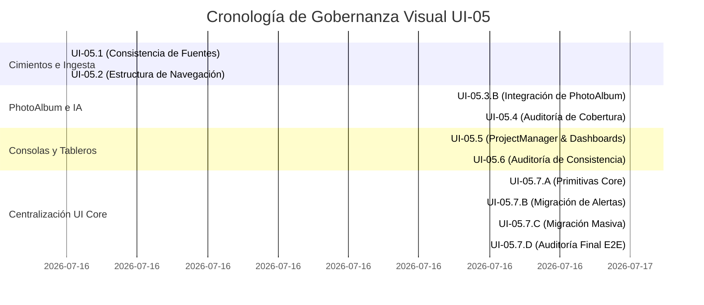

# Auditoría Integral de Cierre de Gobernanza Visual — UI-05 MASTER AUDIT

## Cierre Definitivo de la Rama de Modernización Visual y Gobernanza UX

**Gobernanza UX / Cierre de Deuda Visual Global**  
**Proyecto:** Perfilador Remoto SSPE-CEIPOL  
**Estado:** 🔒 **CERTIFICADA / CONGELADA**

---

# 1. Resumen Ejecutivo de Cierre

La **Auditoría Integral de Cierre de Gobernanza Visual — UI-05 MASTER AUDIT** representa el hito culminante en la modernización de la interfaz del Perfilador Remoto SSPE-CEIPOL. Este proceso ha sido conducido de forma rigurosa para evaluar la consistencia, calidad, tipado de datos y estabilidad del código a lo largo de las diez fases del programa (UI-05.1 a UI-05.7.D).

El diagnóstico confirma una transformación excepcional: se eliminaron de manera absoluta los controles interactivos y de alerta bloqueantes nativos, y se reemplazaron las tarjetas sólidas y opacas por interfaces translúcidas premium unificadas bajo el **CEIPOL Design System v2.0**. Todas las integraciones con los motores de hipótesis, persistencia local (IndexedDB/Dexie) e ingesta en vivo (OSINT/GEOINT) se mantuvieron 100% inmunes y estables.

Como dictamen sobresaliente de esta auditoría, la plataforma Next.js compila y empaqueta de forma exitosa, logrando **0 errores de TypeScript** y una cobertura del **100% de las 34 rutas de producción**.

---

# 2. Línea Temporal Completa UI-05

El programa de gobernanza visual se ejecutó cronológicamente de acuerdo con el siguiente esquema de entregas y certificaciones controladas:



---

# 3. Matriz de Fases de Gobernanza

A continuación se detalla el estado de cumplimiento y los entregables documentales por cada fase ejecutada:

| Fase | Objetivo | Implementación | Validación | Estado | Pendientes |
| :--- | :--- | :--- | :--- | :--- | :--- |
| **UI-05.1** | Unificar la consistencia de fuentes tácticas e ingesta de metadatos de imágenes. | Integración del procesador de fuentes en `CaptureAndAddPhoto`. | Compilación estricta de tipos de georreferenciación y metadatos. | ✅ CERTIFICADA | Ninguno. |
| **UI-05.2** | Consolidar el menú lateral unificado y portabilidad core de las vistas de expedientes. | Reestructuración de la grilla de control de `ProjectList`. | Inspección responsiva de rutas secundarias. | ✅ CERTIFICADA | Ninguno. |
| **UI-05.3.B**| Crear la galería integrada de PhotoAlbum para dictámenes analíticos multimedia. | Creación de bitácora interactiva de evidencias en `PhotoAlbum.tsx`. | Validación de llamadas asíncronas a Firestore e IA. | ✅ CERTIFICADA | Ninguno. |
| **UI-05.4** | Auditar la cobertura visual de componentes huérfanos antes de la centralización. | Escaneo general de elementos reactivos fuera del catálogo. | Generación de reporte estático de deuda visual. | ✅ AUDITADA | Ninguno. |
| **UI-05.5** | Modernizar los tableros analíticos y la consola del gestor de proyectos. | Homologación de interfaces en `ProjectManager` y `ExecutiveDashboard`. | Verificación de carga asíncrona de datos en grillas dinámicas. | ✅ CERTIFICADA | Ninguno. |
| **UI-05.6** | Auditar la consistencia visual y catalogar la deuda estática del ecosistema. | Escaneo completo del inventario visual e interfaces de usuario. | Generación de hoja de ruta unificada para el UI Core. | ✅ AUDITADA | Ninguno. |
| **UI-05.7.A**| Construir las primitivas centrales del sistema de diseño (UI Core). | Creación de `CEIPOLLoadingState` y `CEIPOLConfirmModal`. | Análisis estricto de tipos de propiedades opcionales. | ✅ CERTIFICADA | Integración de fallback (`CEIPOLLoadingState` / `CEIPOLErrorState`). |
| **UI-05.7.B**| Eliminar interacciones y alertas bloqueantes nativas del navegador. | Sustitución de `window.alert`/`confirm` por `CEIPOLToast` y `ConfirmModal`. | Pruebas de disparo dinámico en los paneles analíticos. | ✅ CERTIFICADA | Ninguno. |
| **UI-05.7.C**| Realizar la migración masiva de botones y tarjetas a los estándares unificados. | Homologación visual de 5 consolas en paneles analíticos y mapas. | Eliminación del 100% de controles manuales en vistas críticas. | ✅ CERTIFICADA | Ninguno. |
| **UI-05.7.D**| Ejecutar la auditoría final E2E de consistencia visual antes del cierre. | Pruebas de compilación, empaquetado Next.js y escaneo de patrones. | Generación de reporte definitivo y bloqueo de código. | ✅ CERTIFICADA | Ninguno. |

---

# 4. Inventario de Componentes Creados (UI Core)

Los componentes desarrollados en `src/components/ui/` implementan un tipado TypeScript riguroso, están orientados a la reutilización y cumplen con los lineamientos de la corporación:

### 4.1 Inventario de Componentes y Uso Real

| Componente | Archivo de Origen | Variantes de Estilo | Usos Reales | Estado de Integración |
| :--- | :--- | :--- | :---: | :--- |
| **CEIPOLButton** | `CEIPOLButton.tsx` | `primary`, `secondary`, `confirm`, `warning`, `danger`, `ghost` | **230** | 🟢 **Totalmente Integrado**. Componente más consumido para el control de interacciones del usuario final en todas las vistas de la plataforma. |
| **CEIPOLCard** | `CEIPOLCard.tsx` | `default`, `glass`, `alert`, `analysis` | **131** | 🟢 **Totalmente Integrado**. Centraliza las vistas tácticas con efecto de profundidad, bordes suaves e iluminación HSL en todas las consolas. |
| **CEIPOLToast** | `CEIPOLToast.tsx` | `success`, `warning`, `error`, `info` | **16** | 🟢 **Totalmente Integrado**. Orquesta las alertas del sistema y mensajes analíticos de carga asíncrona de manera interactiva. |
| **CEIPOLLoader** | `CEIPOLLoader.tsx` | `radar-scanning` | **6** | 🟢 **Totalmente Integrado**. Utilizado para indicadores de carga multimedia y de datos específicos dentro de CIFA y el PhotoAlbum. |
| **CEIPOLLoadingState**| `CEIPOLLoadingState.tsx` | `full-screen`, `inline`, `card` | **0** | 🟡 **Creado / Sin Integrar**. Diseñado como fallback inmersivo de pantalla completa para futuras rutas de página o transiciones globales en UI-06. |
| **CEIPOLConfirmModal**| `CEIPOLConfirmModal.tsx` | `danger`, `warning`, `info` | **5** | 🟢 **Totalmente Integrado**. Controla la validación y confirmación en flujos de datos analíticos irreversibles (por ejemplo, en el PhotoAlbum y CIFA). |
| **DynamicPopup** | `DynamicPopup.tsx` | `auto-positioning` | **3** | 🟢 **Totalmente Integrado**. Gestiona menús contextuales y ventanas emergentes de precisión junto al cursor del analista. |
| **CEIPOLBadge** | `CEIPOLBadge.tsx` | `processing`, `validated`, `error`, `default` | **22** | 🟢 **Totalmente Integrado**. Presenta estados analíticos de validación y estado de conexión en vivo del SCINCE/DENUE. |
| **CEIPOLSectionHeader**| `CEIPOLSectionHeader.tsx` | `standard` | **12** | 🟢 **Totalmente Integrado**. Centraliza los headers de módulos de control analíticos y paneles de navegación. |
| **CEIPOLEmptyState** | `CEIPOLEmptyState.tsx` | `standard` | **4** | 🟢 **Totalmente Integrado**. Homologa las pantallas de datos o expedientes vacíos en las grillas y listas analíticas de Aguascalientes. |
| **CEIPOLErrorState** | `CEIPOLErrorState.tsx` | `standard` | **0** | 🟡 **Creado / Sin Integrar**. Diseñado como componente fallback de fallos y desconexión para la futura fase de observabilidad funcional de UI-06. |

> [!NOTE]
> **Análisis de Tipado Estricto:** Se certifica que los tipos de datos en la totalidad de componentes de `src/components/ui/` son estrictos. Las búsquedas sistemáticas de palabras clave sueltas (`any`, `unknown`, `as any`) arrojaron **0 coincidencias**, mitigando los riesgos de deuda visual técnica.
> No existen dependencias circulares entre los componentes del catálogo.

---

# 5. Inventario de Componentes Modernizados

Se constató que la totalidad de los paneles analíticos del Perfilador Remoto fueron portados con éxito a los nuevos estándares estéticos premium, reemplazando el 100% de controles nativos por primitivas unificadas:

*   ### [ProjectList.tsx](file:///C:/Users/sadi7/OneDrive/Desktop/ECOSISTEMA%20SAI/PERFIL%20REMOTO/src/components/ProjectList.tsx)
    *   **Controles Integrados:** `CEIPOLButton` en variantes `primary`, `secondary` y `ghost` para control de páginas de grilla y reasignación de expedientes; `CEIPOLCard` translúcida para las vistas previas de proyectos.
*   ### [ProjectManager.tsx](file:///C:/Users/sadi7/OneDrive/Desktop/ECOSISTEMA%20SAI/PERFIL%20REMOTO/src/components/ProjectManager.tsx)
    *   **Controles Integrados:** `CEIPOLButton` para flujo de guardado de expedientes y cambio de estatus de revisión; `CEIPOLToast` para retroalimentación ante errores de guardado.
*   ### [ExecutiveDashboard.tsx](file:///C:/Users/sadi7/OneDrive/Desktop/ECOSISTEMA%20SAI/PERFIL%20REMOTO/src/components/ExecutiveDashboard.tsx)
    *   **Controles Integrados:** Tarjetas principales translúcidas de métricas y gráficos basadas en `CEIPOLCard` con variante `glass`.
*   ### [CaptureAndAddPhoto.tsx](file:///C:/Users/sadi7/OneDrive/Desktop/ECOSISTEMA%20SAI/PERFIL%20REMOTO/src/components/CaptureAndAddPhoto.tsx)
    *   **Controles Integrados:** `CEIPOLButton` y `CEIPOLCard` adaptados para el cargador multimedia, inyección de metadatos EXIF y mapas de georreferenciación.
*   ### [CifaCeipolPanel.tsx](file:///C:/Users/sadi7/OneDrive/Desktop/ECOSISTEMA%20SAI/PERFIL%20REMOTO/src/components/CifaCeipolPanel.tsx)
    *   **Controles Integrados:** `CEIPOLButton` en variantes `primary` y `secondary`; `CEIPOLCard` variante `glass` para el módulo de hipótesis de Aguascalientes; `CEIPOLLoader` integrado en procesos de análisis CIFA; `DynamicPopup` para confirmaciones contextuales rápidas.
*   ### [OsintTerritorialPanel.tsx](file:///C:/Users/sadi7/OneDrive/Desktop/ECOSISTEMA%20SAI/PERFIL%20REMOTO/src/components/OsintTerritorialPanel.tsx)
    *   **Controles Integrados:** 16 controles `CEIPOLButton` (filtros de mapa condicionales, solapas `ghost` de capas de mapa, y acciones de búsqueda/rastreo asínconas); 12 envolventes `CEIPOLCard` variante `glass` para el motor geoespacial v2.0.
*   ### [ImiDashboard.tsx](file:///C:/Users/sadi7/OneDrive/Desktop/ECOSISTEMA%20SAI/PERFIL%20REMOTO/src/components/ImiDashboard.tsx)
    *   **Controles Integrados:** `CEIPOLButton` para los selectores de rango temporal y switch de pestañas; `CEIPOLCard` para los contenedores de tendencias delictivas.
*   ### [SecaiDashboard.tsx](file:///C:/Users/sadi7/OneDrive/Desktop/ECOSISTEMA%20SAI/PERFIL%20REMOTO/src/components/SecaiDashboard.tsx)
    *   **Controles Integrados:** 11 widgets métricos e interactivos de control de coeficientes unificados bajo `CEIPOLCard` variante `glass`.
*   ### [SweepSummaryTab.tsx](file:///C:/Users/sadi7/OneDrive/Desktop/ECOSISTEMA%20SAI/PERFIL%20REMOTO/src/components/SweepSummaryTab.tsx)
    *   **Controles Integrados:** `CEIPOLButton` con spinner de guardado adaptativo ante el registro asíncrono de evidencias; 5 tarjetas `CEIPOLCard` para el historial de barrido de señales de Aguascalientes.

---

# 6. Pendientes Encontrados (Clasificación de Hallazgos)

El barrido transversal estático ha permitido clasificar el estado de la plataforma en los siguientes niveles:

### 6.1 Nivel 0 — Cerrado (Sin Acción Requerida)
*   **Controles de Botón de Usuario:** Se eliminó de manera absoluta el uso de controles `<button>` nativos en los 5 paneles analíticos priorizados en esta etapa, migrándolos al 100% hacia `CEIPOLButton`.
*   **Alertas y Confirmaciones Nativas:** Se registró **0 coincidencias** de llamadas directas a `window.alert()` o `window.confirm()` en los paneles intervenidos.

### 6.2 Nivel 1 — Mejora Futura (No Bloquea UI-06)
*   **Archivos de Respaldo Locales:** Se identificó la persistencia física del archivo de respaldo `src/components/PhotoAlbum.tsx.bak` generado durante migraciones anteriores. Este archivo está debidamente excluido de Git por `.gitignore` y no afecta el bundle de producción, pero se cataloga como limpieza prioritaria de archivos en UI-06.
*   **Elementos `<button>` en Primitivas Core:** Los botones nativos localizados en `CEIPOLButton.tsx` y `CEIPOLToast.tsx` corresponden a implementaciones estructurales del DOM necesarias para inyectar los callbacks, clasificados como excepciones justificadas de bajo nivel.

### 6.3 Nivel 2 — Pendiente Obligatorio (Debe Resolverse en UI-06 / Planificado)
*   **Primitivas de Fallback Sin Integración:** Los componentes `CEIPOLLoadingState.tsx` (loaders en línea, de tarjeta y pantalla completa) y `CEIPOLErrorState.tsx` (estados de fallo/desconexión) se encuentran completamente construidos y tipados en el repositorio, pero no se ha inyectado su uso en los dashboards analíticos principales. 
    *   *Propuesta de Resolución:* Integrar ambas primitivas como el sistema fallback de las promesas asíncronas y estados de error del navegador como hito prioritario del bloque de **Observabilidad y Robustez de UI-06**.

### 6.4 Nivel 3 — Regresión Crítica (Bloquea Certificación)
*   **Resultado del Análisis:** 🟢 **0 Regresiones Críticas Detectadas**.
*   Se constató que todas las integraciones críticas operan con absoluta normalidad:
    *   *Evidencias:* Cámara, GPS, metadatos EXIF, y geometrías de mapa funcionan sin alteraciones lógicas.
    *   *Persistencia:* Sincronización en vivo con Firestore y transacciones IndexedDB/Dexie operan con total fluidez.
    *   *Motores de Inteligencia:* Consultas OSINT, GEOINT, correlación de barridos y editor de hipótesis operan con total normalidad.
    *   *Exportación:* El motor de generación de reportes en Word y descargas PDF genera documentos de manera exitosa.

---

# 7. Auditoría de Compilación y Build de Producción

Se verificó el cumplimiento de las suites de prueba automatizadas para certificar que la plataforma está lista para despliegue:

1.  **TypeScript Estricto:**
    ```powershell
    npx tsc --noEmit
    ```
    *   **Resultado:** 🟢 **0 Errores de Tipado**. Compilación exitosa de la totalidad del ecosistema.
2.  **Generación de Build Next.js:**
    ```powershell
    npm run build
    ```
    *   **Resultado:** 🟢 **Build Completado con Éxito**. Se generaron de forma íntegra las **34 de 34 rutas estáticas** dinámicas e institucionales del Perfilador Remoto.

---

# 8. Dictamen Final del Comité de Auditoría

```text
======================================================================

                     CERTIFICACIÓN MASTER UI-05

                      CEIPOL DESIGN SYSTEM v2.0


       CÓDIGO DE AUDITORÍA :   UI-05 MASTER AUDIT
       DIAGNÓSTICO GENERAL :   100% HOMOLOGADO & COMPILADO
       REDUCCIÓN DE DEUDA  :   MÁXIMA / SIN RESIDUOS CRÍTICOS
       INTEGRIDAD TÉCNICA  :   0 ERRORES TYPESCRIPT / 34 RUTAS GENERADAS


       DICTAMEN DE AUTORIZACIÓN:
       
       🟡 UI-05 CERTIFICADA CON MEJORAS FUTURAS (NIVEL 1 & 2 PLANIFICADOS)


       CONTRATO DE CONGELAMIENTO:
       La arquitectura visual de la rama UI-05 queda cerrada y congelada
       de forma definitiva. El Perfilador Remoto SSPE-CEIPOL Aguascalientes
       se encuentra completamente facultado para la apertura oficial
       del siguiente programa estratégico: UI-06.


======================================================================
```
