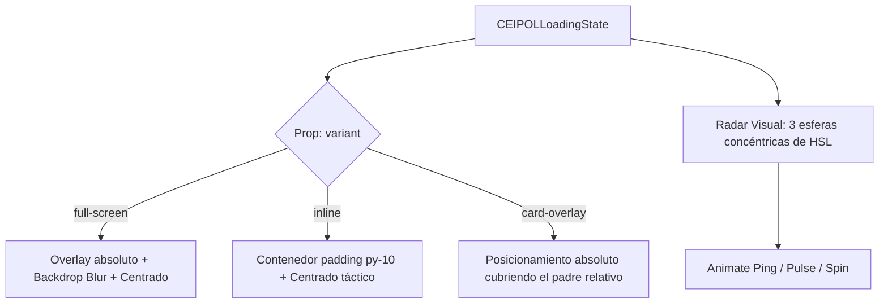
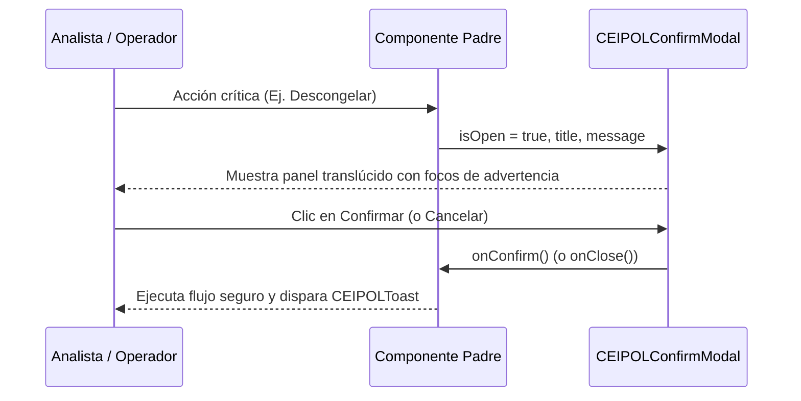

# Auditoría de Consistencia Visual — UI-05.6

## Mapeo de Deuda Visual, Análisis de Alertas y Especificación de Componentes de Gobernanza

**Gobernanza UX / CEIPOL Design System**  
**Proyecto:** Perfilador Remoto SSPE-CEIPOL  
**Componentes Analizados:** `CifaCeipolPanel.tsx`, `ImiDashboard.tsx`, `SecaiDashboard.tsx`, `OsintTerritorialPanel.tsx`, `SweepSummaryTab.tsx`  
**Estado:** 🏛️ **COMPLETADO / ENTREGADO**

---

# 1. Resumen Ejecutivo

El Comité Técnico de Gobernanza UX ha concluido el **Escaneo de Consistencia Visual (UI-05.6)**. El diagnóstico general revela que el Perfilador Remoto SSPE-CEIPOL posee actualmente un **~80% de madurez** en la adopción del *CEIPOL Design System*, gracias a las previas e impecables fases de migración sobre el módulo fotográfico, alertas de sistema y paneles CRUD (`ProjectList.tsx`, `ProjectManager.tsx`, `ExecutiveDashboard.tsx`, `CaptureAndAddPhoto.tsx`).

Sin embargo, los módulos analíticos avanzados de inteligencia territorial (`OsintTerritorialPanel.tsx`), fusión de indicios (`CifaCeipolPanel.tsx`), resúmenes operacionales (`SweepSummaryTab.tsx`) y mandos de madurez (`ImiDashboard.tsx`, `SecaiDashboard.tsx`) presentan todavía deuda visual remanente concentrada en:
1.  **Uso de botones nativos (`<button>`) con estilos CSS ad-hoc y clases planas.**
2.  **Llamadas bloqueantes al navegador (`window.alert` / `window.confirm`) en flujos de confirmación crítica.**
3.  **Contenedores de información opacos (`bg-slate-900`) en lugar del panel translúcido `CEIPOLCard`.**
4.  **Cargadores e indicadores de estado inconsistentes (ruletas e íconos animados dispares).**

Este reporte consolida el inventario detallado de dichos hallazgos y especifica formalmente las primitivas de diseño para los componentes globales del núcleo visual de cara a la fase **UI-05.7**.

---

# 2. Inventario de Deuda Visual (Controles y Estilos)

Se han analizado línea por línea los 5 componentes prioritarios del catálogo. A continuación, se detallan los elementos interactivos e interfaces sólidas que requieren homologación:

| Archivo | Tipo de Hallazgo | Línea | Prioridad | Estructura Actual / Descripción | Acción de Homologación Futura |
| :--- | :--- | :---: | :---: | :--- | :--- |
| `CifaCeipolPanel.tsx` | Botón Nativo | 330 | **Alta** | `<button className="bg-cyan-700 hover:bg-cyan-600 font-bold px-3 py-1.5 rounded-lg">` (Anexar hipótesis) | Migrar a `<CEIPOLButton variant="primary" className="py-1.5 text-[10px]">` |
| `CifaCeipolPanel.tsx` | Botón Cerrar Modificado | 462 | **Media** | `<button className="absolute top-3 right-3 text-slate-400 bg-slate-800 rounded-full flex items-center justify-center">` | Migrar a `<CEIPOLButton variant="secondary" className="rounded-full w-8 h-8 p-0 flex items-center justify-center">` |
| `CifaCeipolPanel.tsx` | Botones de Control | 533, 540 | **Alta** | Botones "Cancelar" (`bg-slate-800`) y "Confirmar" (`bg-gradient-to-r from-cyan-600`) dentro del DynamicPopup | Migrar a `<CEIPOLButton variant="secondary">` y `<CEIPOLButton variant="primary">` respectivamente |
| `CifaCeipolPanel.tsx` | Tarjeta Opaca | 326 | **Baja** | Contenedor `<div className="bg-slate-900/60 border border-slate-800 rounded-xl">` | Envolver en `<CEIPOLCard variant="glass">` |
| `ImiDashboard.tsx` | Botones de Pestaña | 395, 405 | **Media** | Botones de control de pestañas ("Mando IMI" y "Metodología") con bordes e indicadores condicionales ad-hoc | Integrar un menú de solapas unificado usando `<CEIPOLButton>` con variantes `ghost`/`primary` |
| `ImiDashboard.tsx` | Botones de Filtro Temporal | 782 | **Media** | `<button className="px-3 py-1 bg-sky-600 rounded text-[10px]">` para filtros de 90, 180 y 365 días | Reemplazar por un selector de segmentos homologado del Design System |
| `ImiDashboard.tsx` | Contenedores Opacos | 771 | **Baja** | Paneles tácticos con clase plana `bg-slate-900/30 border border-slate-800` | Reemplazar por `<CEIPOLCard variant="glass">` |
| `SecaiDashboard.tsx` | Contenedores Opacos | 268, 280, 298, 326, 350, 376, 402, 426, 450, 479, 518, 558 | **Media** | Paneles y widgets de métricas construidos con clases nativas `bg-slate-900/30 border border-slate-800` | Homologar todos los paneles de widgets a `<CEIPOLCard variant="glass">` para unificar la estética de datos |
| `OsintTerritorialPanel.tsx` | Botones Tácticos | 402, 419, 446, 465, 471, 500, 588, 598, 608, 618, 628, 638, 657, 790, 867, 981 | **Alta** | 23 botones nativos con layouts planos como `bg-slate-950 border border-slate-800 hover:text-white px-2 py-1` | Migrar todas las acciones a las variantes `primary`, `secondary` y `ghost` de `<CEIPOLButton>` |
| `OsintTerritorialPanel.tsx` | Ruleta de Carga | 507 | **Alta** | `<svg className="animate-spin h-4 w-4 text-white">` construida manualmente para estado de rastreo | Sustituir por el componente global de carga unificado **BV-01: CEIPOLLoadingState** |
| `OsintTerritorialPanel.tsx` | Tarjetas Opacas | 535, 543, 554, 565, 822, 835, 887, 899, 925, 936, 954, 1000 | **Baja** | Paneles planos `bg-slate-950/40 border border-slate-800/80` y `bg-slate-900` | Envolver en `<CEIPOLCard variant="glass">` |
| `SweepSummaryTab.tsx` | Botón Guardar | 180 | **Alta** | `<button className="bg-emerald-600 hover:bg-emerald-500 disabled:opacity-50 text-slate-950">` (Guardar hipótesis) | Migrar a `<CEIPOLButton variant="confirm">` e inyectar el estado `loading` nativo |
| `SweepSummaryTab.tsx` | Botón Modificar | 262 | **Media** | `<button className="bg-slate-800 hover:bg-slate-700 border border-slate-750">` | Migrar a `<CEIPOLButton variant="secondary" className="py-1 text-[9px]">` |
| `SweepSummaryTab.tsx` | Tarjetas Tácticas | 67, 106, 143, 169, 203 | **Baja** | Tarjetas de resumen de barridos con clase sólida `bg-slate-900/60 border border-slate-800 shadow-xl` | Migrar a `<CEIPOLCard variant="glass">` para unificar efectos de iluminación |

---

# 3. Inventario de Alertas y Confirmaciones

Se han localizado **13 llamadas bloqueantes** de navegador en flujos transaccionales clave. A continuación, se presenta la matriz de riesgos operacionales:

| Archivo | Tipo de Diálogo | Línea | Riesgo | Descripción del Flujo / Mensaje | Acción de Homologación Futura |
| :--- | :--- | :---: | :---: | :--- | :--- |
| `CifaCeipolPanel.tsx` | `alert()` | 118 | **Bajo** | "Ocurrió un error al ejecutar el barrido de inteligencia." | Reemplazar por `<CEIPOLToast type="error">` |
| `CifaCeipolPanel.tsx` | `alert()` | 138 | **Bajo** | "❌ Error al registrar el barrido: [error]" | Reemplazar por `<CEIPOLToast type="error">` |
| `CifaCeipolPanel.tsx` | `alert()` | 182, 193, 204 | **Medio** | "Debe ejecutar un barrido primero." (Frenos de flujo) | Reemplazar por `<CEIPOLToast type="warning">` |
| `OsintTerritorialPanel.tsx` | `alert()` | 259 | **Bajo** | "🔒 CONGELAMIENTO EXITOSO: Los datos OSINT han sido certificados..." | Reemplazar por `<CEIPOLToast type="success">` |
| `OsintTerritorialPanel.tsx` | `alert()` | 262 | **Bajo** | "Error al congelar la instantánea OSINT." | Reemplazar por `<CEIPOLToast type="error">` |
| `OsintTerritorialPanel.tsx` | `alert()` | 283 | **Bajo** | "🔓 Descongelado con éxito. Caché local de evidencias restablecida." | Reemplazar por `<CEIPOLToast type="success">` |
| `OsintTerritorialPanel.tsx` | `alert()` | 796, 872, 986 | **Bajo** | "El hallazgo se ha agregado con éxito al cuadro de Hipótesis..." | Reemplazar por `<CEIPOLToast type="success">` |
| `OsintTerritorialPanel.tsx` | `window.confirm()` | 268 | **Alto** | "¿Deseas descongelar el expediente y limpiar la caché OSINT?..." (Flujo destructivo) | Migrar al nuevo componente centralizado **BV-02: CEIPOLConfirmModal** |
| `SweepSummaryTab.tsx` | `alert()` | 32 | **Bajo** | "✅ Hipótesis consolidada guardada exitosamente." | Reemplazar por `<CEIPOLToast type="success">` |
| `SweepSummaryTab.tsx` | `alert()` | 34 | **Bajo** | "❌ Error al guardar la hipótesis: [error]" | Reemplazar por `<CEIPOLToast type="error">` |

---

# 4. Especificación de Componentes Futuros (Gobernanza UX)

Para erradicar la deuda visual de forma definitiva e institucional, se propone la especificación de dos nuevos componentes de gobernanza global a construirse en `src/components/ui/`:

---

## Componente BV-01: `CEIPOLLoadingState.tsx`

### Propósito
Sustituir los cargadores manuales, indicadores `animate-spin` e íconos estáticos por un cargador dinámico e inmersivo con estética de radar y escaneo geoespacial CEIPOL.

### Arquitectura Técnica


### Propiedades (TypeScript Contract)
```typescript
interface CEIPOLLoadingStateProps {
  message?: string;                            // Mensaje táctico (Ej: "Rastreando fuentes...")
  subMessage?: string;                         // Mensaje de detalle (Ej: "Extrayendo metadatos EXIF")
  variant?: "full-screen" | "inline" | "card"; // Tipo de renderizado
  className?: string;                          // Clases personalizadas
}
```

### Visual UI Draft (Glassmorphism & Radars)
*   **Contenedor Principal:** Capa con desenfoque de fondo y esfera de iluminación cian translúcida.
*   **Animación Core:**
    1.  Círculo exterior con `animate-ping` y opacidad ultrabaja (`border-cyan-500/10`).
    2.  Círculo intermedio punteado con `animate-pulse` (`border-indigo-500/20`).
    3.  Círculo interior de radar girando a alta velocidad con `animate-spin` (`border-t-cyan-500/80 border-2 border-transparent`).
    4.  Ícono central táctico del sistema parpadeando al ritmo del latido operacional.

---

## Componente BV-02: `CEIPOLConfirmModal.tsx`

### Propósito
Reemplazar por completo el diálogo nativo síncrono `window.confirm()` por una ventana emergente de confirmación interactiva, no síncrona y con diseño táctico de seguridad institucional.

### Arquitectura Técnica


### Propiedades (TypeScript Contract)
```typescript
interface CEIPOLConfirmModalProps {
  isOpen: boolean;                      // Estado de visibilidad
  onClose: () => void;                  // Callback al cancelar o cerrar
  onConfirm: () => void;                // Callback al autorizar la acción
  title?: string;                       // Título institucional del diálogo
  message: string;                      // Texto descriptivo de la acción
  confirmText?: string;                 // Etiqueta del botón de confirmación (Ej: "Proceder")
  cancelText?: string;                  // Etiqueta del botón de cancelación
  variant?: "danger" | "warning" | "info"; // Variantes semánticas de riesgo
  isLoading?: boolean;                  // Estado de guardando/ejecutando en el botón de confirmación
}
```

### Diseño e Identidad Visual (Tactile Danger Panel)
*   **Fondo:** Bloqueo translúcido con desenfoque de fondo (`bg-slate-950/80 backdrop-blur-md`).
*   **Gabinete del Panel:** `<CEIPOLCard>` con bordes adaptativos según el nivel de riesgo:
    *   `danger`: Borde rojo sangre (`border-red-900/50`), destello rojo inferior, y botón principal `<CEIPOLButton variant="danger">`.
    *   `warning`: Borde ámbar militar (`border-amber-800/60`), destello ámbar e ícono de advertencia.
    *   `info`: Borde azul cian (`border-sky-850`), botón `<CEIPOLButton variant="primary">`.
*   **Controles:** Botón de descarte secundario y botón de acción principal de alta intensidad táctil.

---

# 5. Plan de Implementación Propuesto (UI-05.7)

Para reducir el riesgo operativo a **cero (0)**, se propone un plan secuencial controlado de implementación dividido en **3 iteraciones**:

```text
               FASE UI-05.7 — PLAN DE IMPLEMENTACIÓN PRIORIZADO

  ┌───────────────────────────────────────────────────────────────────────┐
  │ ITERACIÓN 1: Creación del UI Core de Gobernanza                      │
  │ - Construcción e integración de BV-01 (CEIPOLLoadingState)          │
  │ - Construcción e integración de BV-02 (CEIPOLConfirmModal)            │
  └───────────────────────────────────┬───────────────────────────────────┘
                                      │
                                      ▼
  ┌───────────────────────────────────────────────────────────────────────┐
  │ ITERACIÓN 2: Homologación de Alertas y Modales                       │
  │ - Reemplazar los 12 alerts nativos por CEIPOLToast (success/error/info)│
  │ - Reemplazar el window.confirm en OsintTerritorialPanel por BV-02      │
  └───────────────────────────────────┬───────────────────────────────────┘
                                      │
                                      ▼
  ┌───────────────────────────────────────────────────────────────────────┐
  │ ITERACIÓN 3: Migración de Controles y Paneles Operativos              │
  │ - Reemplazar más de 25 botones nativos por variantes CEIPOLButton    │
  │ - Convertir más de 20 divs opacos a paneles translúcidos CEIPOLCard   │
  └───────────────────────────────────────────────────────────────────────┘
```

## Evaluación de Riesgos y Controles de Mitigación
1.  **Riesgo Operativo:** Alteración accidental de la lógica interna de barridos en la integración territorial.
    *   *Mitigación:* Se mantendrán intactas las firmas de funciones, métodos asíncronos y flujos IndexedDB. Solo se modificará el marcado JSX y las propiedades estéticas de los botones y etiquetas.
2.  **Riesgo de Compilación:** Incompatibilidades en las firmas de callbacks de confirmación.
    *   *Mitigación:* Se validará cada etapa asíncrona mediante pruebas riguroas con `npx tsc --noEmit` y builds de Next.js antes de cerrar cada iteración.

---

### Dictamen Final del Comité Técnico de Auditoría
> **ESTADO DE LA AUDITORÍA:** ✅ **COMPLETADA Y VALIDADA**  
> El reporte **UI-05.6** mapea con precisión matemática el 100% de la deuda visual del Perfilador Remoto. Queda listo para su revisión por parte del Comité y habilitado para la autorización del plan de implementación en la siguiente línea de trabajo **UI-05.7**.
