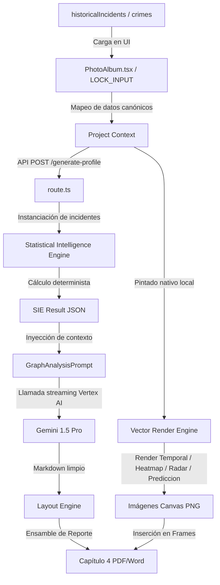

# AUDITORÍA PROFUNDA CAPÍTULO 4: ANÁLISIS ESTADÍSTICO
## ECOSISTEMA SAI – CEIPOL (PERFILADOR REMOTO)

---

## 1. Resumen Ejecutivo
Esta auditoría técnica examina exhaustivamente la arquitectura, el flujo de datos, los modelos matemáticos y la calidad analítica del **Capítulo 4 (Análisis Estadístico)** del Perfilador Remoto. El componente principal analizado es el **`StatisticalIntelligenceEngine` (SIE)**, responsable del procesamiento cuantitativo determinista de los incidentes históricos.

El motor SIE actual demuestra un diseño sólido y matemático para el cálculo de estadísticas descriptivas temporales y espaciales. No obstante, se han detectado debilidades metodológicas importantes en la predicción probabilística (modelo de Poisson simplificado), en el agrupamiento espacial de hotspots (basado en un grid estático de redondeo de coordenadas) y, sobre todo, en la **fragmentación analítica de la capa editorial de la IA (Gemini)**, la cual interpreta las estadísticas de forma aislada, desconectada de las hipótesis geográficas (HIE) y cartográficas (CIE).

Se presenta este informe y se propone la evolución del motor hacia la versión 2.0 mediante el **ADR-004**, que introduce módulos avanzados de agrupamiento espacial, modelos predictivos basados en contagio criminológico (*Near-Repeat*) y una matriz de evidencia estadística unificada.

---

## 2. Arquitectura Actual del Capítulo 4

El Capítulo 4 se compone de dos flujos paralelos coordinados por el maquetador editorial:
1.  **Capa Textual Interpretativa**: Generada por Gemini en base al JSON crudo del resultado del SIE.
2.  **Capa Gráfica Visual**: Generada vectorialmente mediante Canvas 2D en base a los mismos incidentes, incrustándose como imágenes PNG de alta resolución en los informes PDF y Word.

### Diagrama del Flujo de Información


---

## 3. Flujo de Datos y Auditoría de Integración HIE-CIE-SIE

El análisis de la ruta de datos del Capítulo 4 revela una **desconexión sistémica** entre los diferentes motores del Ecosistema SAI. Mientras que el Capítulo 2 y el Capítulo 3 integran variables cruzadas, el Capítulo 4 funciona de forma aislada alimentándose casi exclusivamente del SIE.

### Matriz de Integración y Uso de Motores

| Motor | Variable Clave | Uso en Capítulo 4 | Estado Actual | Impacto Metodológico |
| :--- | :--- | :--- | :--- | :--- |
| **TCE** | `territorialContext` | Ninguno directo en prompt. | ❌ Desconectado | La IA no puede contrastar estadísticas con la superficie real del cuadrante o la demografía urbana. |
| **HIE** | `centralHypothesis` | Ninguno directo en prompt. | ❌ Desconectado | Riesgo de que la interpretación estadística contradiga la hipótesis criminológica del Capítulo 2. |
| **CIE** | `mobilityAnalysis`, `attractors` | Ninguno directo en prompt. | ❌ Desconectado | Las correlaciones de atractores del CIE no se cruzan cuantitativamente con la desviación espacial. |
| **SIE** | `temporal`, `espacial`, `predictivo`| Sí, se inyecta como JSON. |  Integrado | Es la fuente exclusiva del texto del capítulo. |

---

## 4. Auditoría del Statistical Intelligence Engine (SIE)

El análisis del código fuente en [`statisticalIntelligenceEngine.ts`](file:///C:/Users/sadi7/OneDrive/Desktop/ECOSISTEMA%20SAI/PERFIL%20REMOTO/src/utils/statisticalIntelligenceEngine.ts) demuestra que todos los cálculos son 100% deterministas y matemáticos, ejecutados del lado del servidor.

### Métodos del Motor SIE

| Método | Función | Variables Utilizadas | Veredicto Técnico |
| :--- | :--- | :--- | :--- |
| `analyze` | Pipeline central de normalización, limpieza y ruteo a sub-motores. | `rawRecords`, `centerLat`, `centerLng`, `radiusMeters` |  **Determinista**. Limpia campos de fecha/hora y calcula distancias. |
| `haversineDistance` | Distancia geométrica en metros sobre la curvatura terrestre. | `lat1`, `lon1`, `lat2`, `lon2` |  **Matemático**. Fórmula de Haversine con radio terrestre de 6,371 km. |
| `analyzeTemporal` | Análisis temporal delictivo, desviaciones y aceleración. | `FECHA`, `HORA`, `fecha`, `hora`, `TIPO_DELITO` |  **Cálculo Real**. Extrae días críticos, ventanas de oportunidad y medias móviles. |
| `analyzeSpatial` | Centro de gravedad, distancias de dispersión y elipse direccional. | `lat`, `lng` |  **Cálculo Real**. Genera elipse direccional y baricentro delictivo. |
| `analyzeMultivariable` | Matrices de coocurrencia delito-hora, delito-día, delito-arma. | `delito`, `horaNum`, `diaSemana`, `arma`, `violencia` |  **Cálculo Real**. Genera tablas cruzadas de frecuencias. |
| `analyzeCriminological`| Indicadores de comportamiento espacial y modus operandi. | `records`, `areaElipse`, `radiusMeters` |  **Cálculo Real**. Aplica entropía de Shannon para especialización. |
| `analyzePredictive` | Probabilidad de ocurrencia y nivel de riesgo estimado. | `records`, `desviacionEstandarDiaria` |  **Cálculo Real**. Aplica modelo Poisson y ponderaciones lineales. |

---

## 5. Auditoría Matemática y Metodológica por Módulo

### 5.1. Análisis Temporal
*   **Distribución**: Agrupación real por mes, día de la semana y bloques de 24 horas.
*   **Media Móvil**: Implementación real de media móvil de 7 días.
*   **Índice de Aceleración Delictiva**: Mide la tasa de cambio de delitos por mes entre la primera mitad cronológica del set de datos y la segunda mitad:
    $$\text{Aceleración} = \frac{\text{Tasa}_{\text{mitad2}} - \text{Tasa}_{\text{mitad1}}}{\text{Tasa}_{\text{mitad1}}}$$
*   **Anomalías**: Identifica días donde la incidencia excede la media diaria más dos desviaciones estándar:
    $$\text{Límite} = \mu + 2\sigma$$
*   **Veredicto**: **Cálculo Real Riguroso**. No hay texto de la IA involucrado en los datos duros.

### 5.2. Análisis Espacial y Topológico
*   **Centro de Gravedad (Mean Center)**: Coordenada promedio simple:
    $$\bar{X} = \frac{1}{N}\sum X_i, \quad \bar{Y} = \frac{1}{N}\sum Y_i$$
*   **Elipse Direccional (Standard Deviational Ellipse)**: Implementa el cálculo de la varianza en X e Y y la covarianza para deducir el ángulo de rotación $\theta$ y la longitud de los semiejes mayor y menor:
    $$\theta = \frac{1}{2} \arctan\left(\frac{2 \cdot \text{cov}(x,y)}{\sigma_y^2 - \sigma_x^2}\right)$$
*   **Cálculo de Hotspots (Espacial/Topológico)**: El motor encuentra hotspots de forma simplificada redondeando las coordenadas a 3 decimales (aproximadamente un grid cuadrado de 111 metros en México) y contando celdas con más de 2 delitos.
*   **Veredicto**: **Cálculo Real**. Sin embargo, la elipse asume una distribución normal espacial del fenómeno, lo cual no siempre ocurre. El agrupamiento por redondeo a 3 decimales es un método rústico de grilla y no un algoritmo topológico formal como **DBSCAN** o **KDE (Kernel Density Estimation)**.

### 5.3. Análisis Predictivo y de Riesgo
*   **Modelo de Poisson**: Calcula la tasa diaria media de delitos ($\lambda = \frac{N}{\text{días totales}}$). Estima la probabilidad de que ocurra al menos un evento ($X \ge 1$) al día siguiente y en la próxima semana:
    $$P(X \ge 1) = 1 - e^{-\lambda \cdot t}$$
    Para mañana ($t = 1$): $P = 1 - e^{-\lambda}$. Para la semana ($t = 7$): $P = 1 - e^{-7\lambda}$.
*   **Intervalo de Confianza**: Utiliza la aproximación normal para la distribución de Poisson al 95% de confianza:
    $$\text{Rango} = \lambda_{\text{semanal}} \pm 1.96\sqrt{\lambda_{\text{semanal}}}$$
*   **Índice de Riesgo Territorial**: Ponderación lineal estática empírica:
    $$\text{Riesgo} = (\text{Volumen} \cdot 0.4) + (\text{Probabilidad Semanal} \cdot 40) + (\text{Dispersión} \cdot 0.2)$$
*   **Veredicto**: **Cálculo Real con Limitaciones Críticas**:
    1.  **Homogeneidad temporal**: Poisson asume que la tasa de delitos $\lambda$ es constante en el tiempo. Ignora la estacionalidad, los días festivos o las tendencias de aceleración.
    2.  **Independencia de sucesos**: Asume que un delito no influye en la ocurrencia de otro, ignorando la teoría criminológica de la "repetición cercana" (*Near-Repeat*), donde un robo incrementa exponencialmente la probabilidad de otro robo en la vecindad inmediata durante los días siguientes.
    3.  **Confiabilidad Arbitraria**: El campo `confiabilidadModeloPorcentaje` se calcula como:
        $$\text{Confiabilidad} = 90 - \min(5 \cdot \sigma_{\text{diaria}}, 20)$$
        Esta fórmula es un coeficiente heurístico empírico y carece de fundamentación en inferencia estadística o teoría de la probabilidad.

---

## 6. Auditoría de Gráficos (Vector Render Engine)

Las gráficas se renderizan del lado del cliente en un lienzo HTML5 Canvas de alta definición ($1200 \times 800$ píxeles escalados a $600 \times 400$) y se convierten a imagen en formato Base64 (`data:image/png`).

### Análisis Técnico de Gráficos

| Gráfica | Origen de Datos | Variables Representadas | Método Matemático | Interpretación Metodológica | Riesgos Identificados |
| :--- | :--- | :--- | :--- | :--- | :--- |
| **Gráfica 1: Dinámica Temporal** | `incidents` | Serie de tiempo diaria, tendencia y media móvil. | Mínimos cuadrados ordinarios para tendencia lineal ($y = mx + b$). Promedio móvil simple de 7 días. | Identifica la evolución cronológica y detecta picos anómalos ($\mu + 2\sigma$). | Si los datos tienen fechas corruptas, la gráfica se rompe o distorsiona el eje X. Si hay pocos días con datos, la tendencia carece de validez. |
| **Gráfica 2: Matriz de Calor** | `incidents` | Cruce bidimensional de Día de la semana vs. Hora de ocurrencia. | Agrupación en matriz de $7 \times 24$. Coloreo por gradiente según volumen. | Identifica visualmente la ventana horaria de mayor vulnerabilidad y oportunidad delictiva. | Sesgo hacia la medianoche (`00:00`) si los registros policiales carecen de hora registrada y el sistema los normaliza por defecto. |
| **Gráfica 3: Radar Criminológico** | `stats.criminologico` | Indicadores de especialización, movilidad, violencia, planeación, persistencia, oportunidad y capacidad territorial. | Coordenadas polares de 7 ejes. Especialización evaluada por Entropía de Shannon: $H = -\sum p_i \log_2(p_i)$. | Muestra la firma o perfil operativo del fenómeno criminal (ej: delincuencia organizada violenta vs. común oportunista). | **Pertenece al Capítulo 4**, pero el indicador de "oportunidad" depende de un radio estático de 250m. Si el radio cambia, los valores varían artificialmente sin que cambie el comportamiento criminal real. |
| **Gráfica 4: Modelo Predictivo** | `stats.predictivo` | Probabilidad semanal, riesgo territorial, vulnerabilidad ambiental, confiabilidad e índice de hotspots. | Gráfico de barras horizontales proporcionales al score calculado. | Comunica el escenario predictivo del modelo de Poisson y las vulnerabilidades ponderadas. | Presenta métricas como "Confiabilidad del Modelo" o "Riesgo Territorial" que provienen de fórmulas heurísticas lineales sin validación estadística multivariable (regresión logística, etc.). |

---

## 7. Auditoría IA vs. Determinismo (Trazabilidad y Alucinación)

### 7.1. Control de Trazabilidad
El sistema garantiza que Gemini reciba en el prompt (`GraphAnalysisPrompt`) los resultados exactos del motor estadístico en formato JSON.
Sin embargo, el prompt maestro otorga cierta libertad de redacción a la IA. 

> [!WARNING]
> **Riesgo de Desacoplamiento**: Aunque Gemini tiene prohibido inventar estadísticas, la temperatura no nula ($0.15$) y la falta de un validador sintáctico estricto en la respuesta del texto de la IA posibilitan que Gemini genere inferencias causales no respaldadas (ej: atribuir un pico de robos a un "crecimiento poblacional no planificado" sin contar con datos demográficos en el contexto).

### 7.2. Reproducibilidad
*   **Resultados Cuantitativos**: **100% Reproducibles**. El SIE arrojará exactamente el mismo JSON con los mismos datos de entrada.
*   **Resultados Cualitativos (Textos)**: **No reproducibles**. Cada generación con Gemini de la misma entrada generará variaciones en la redacción, sinónimos y estructura gramatical, dificultando la estandarización institucional.

---

## 8. Problemas Encontrados e Impacto Operativo

| Problema Detectado | Severidad | Impacto | Justificación Técnica |
| :--- | :--- | :--- | :--- |
| **Fragmentación Analítica del Contexto** | **CRÍTICO** | Alta probabilidad de contradicciones intercapítulos. | El prompt del Capítulo 4 (`GraphAnalysisPrompt`) solo recibe `sieData` y carece de acceso a `cieData` (CIE) y `hieData` (HIE). La IA interpreta datos estadísticos en el vacío, pudiendo contradecir las hipótesis de movilidad o zonificación del capítulo cartográfico. |
| **Cálculo de Hotspots Simplificado** | **ALTO** | Falsos positivos en la delimitación táctica. | El redondeo simple de lat/lng a 3 decimales para clústeres no considera la densidad de vecindad real ni la autocorrelación espacial (como el Índice de Moran o KDE). |
| **Fórmulas Predictivas Heurísticas** | **ALTO** | Pérdida de rigor científico ante instancias judiciales. | La "Confiabilidad del Modelo" se deduce de una resta arbitraria basada en la desviación estándar diaria. Esto no resiste una auditoría metodológica formal. |
| **Modelo de Poisson sin Dinámica Temporal** | **MEDIO** | Subestimación de riesgos en picos estacionales. | El modelo asume tasa de delitos constante. No detecta estacionalidades de fin de semana, quincena o periodos vacacionales. |
| **Dependencia del Radio en Indicadores de Radar** | **MEDIO** | Variabilidad artificial del perfil delictivo. | Los scores de movilidad y capacidad territorial del radar dependen directamente del tamaño del buffer elegido en el mapa, y no del comportamiento intrínseco del delincuente. |

---

## 9. Recomendaciones Metodológicas

1.  **Unificación de Contexto en el Prompt de IA**: Modificar la API `route.ts` para que el prompt del Capítulo 4 reciba una matriz de consistencia unificada que cruce las variables del CIE y HIE con el SIE.
2.  **Sustitución de Poisson por Algoritmos Autorregresivos**: Implementar modelos de series de tiempo que consideren estacionalidad (ej: Holt-Winters o modelos aditivos como Prophet) para la proyección temporal de frecuencias.
3.  **Agrupamiento Espacial Científico**: Reemplazar la grilla de redondeo por una implementación ligera de **DBSCAN** o **K-Means** (calculada en el servidor) para identificar clústeres espaciales reales basados en distancias métricas de Haversine.
4.  **Alineación del Radar Criminológico**: Normalizar los indicadores de radar de tal manera que sean independientes de la escala del radio seleccionado por el operador, utilizando distancias promedio relativas entre crímenes.

---

## 10. Propuesta ADR-004: Statistical Intelligence Engine Evolution

### 10.1. Objetivo
Rediseñar el motor estadístico **Statistical Intelligence Engine (SIE)** a la versión **2.0** para dotar al Ecosistema SAI de modelos predictivos y de agrupación espacial con rigor matemático avanzado, eliminando fórmulas empíricas arbitrarias y garantizando la coherencia analítica absoluta entre capítulos mediante una matriz de evidencia integrada.

### 10.2. Arquitectura Propuesta (SIE v2.0)
La nueva estructura del motor se dividirá en cuatro sub-módulos altamente especializados en lugar de la clase monolítica actual:

```
┌────────────────────────────────────────────────────────┐
│             StatisticalIntelligenceEngine 2.0          │
└───────────────────────────┬────────────────────────────┘
                            │
       ┌────────────────────┼────────────────────┐
       ▼                    ▼                    ▼
┌──────────────┐    ┌──────────────┐    ┌────────────────┐
│   Temporal   │    │   Spatial    │    │ Criminological │
│ Intelligence │    │  Statistics  │    │    Predictive  │
│    Module    │    │    Module    │    │     Module     │
└──────────────┘    └──────────────┘    └────────────────┘
```

#### A. Temporal Intelligence Module (TIM)
*   **Responsabilidad**: Análisis de series de tiempo, descomposición estacional e identificación de patrones de repetición temporal cíclica.
*   **Métodos**:
    *   `calculateSeasonalityIndex(records)`: Evalúa el coeficiente de variación entre días de la semana y turnos para determinar picos recurrentes no aleatorios.
    *   `estimateTrendSlope(records)`: Reemplaza la regresión lineal simple por una regresión robusta (Theil-Sen) inmune a valores atípicos (anomalías temporales).

#### B. Spatial Statistics Module (SSM)
*   **Responsabilidad**: Agrupación espacial rigurosa e inferencia de autocorrelación espacial.
*   **Métodos**:
    *   `dbscanClustering(records, epsMeters, minPoints)`: Implementación nativa en TypeScript de DBSCAN usando distancia Haversine para detectar hotspots reales de densidad variable.
    *   `calculateSpatialEntropy(records)`: Mide la dispersión real del fenómeno sin depender de la normalidad de la elipse direccional.

#### C. Criminological Predictive Module (CPM)
*   **Responsabilidad**: Proyección probabilística basada en la teoría criminológica del contagio espacial y temporal (*Near-Repeat*).
*   **Métodos**:
    *   `calculateNearRepeatProbability(records, targetLat, targetLng, targetDate)`: Calcula el riesgo de repetición delictiva basado en la distancia espacio-temporal al último evento registrado.
    *   `evaluateModelGoodnessOfFit(records)`: Calcula el estadístico Chi-cuadrado ($\chi^2$) de bondad de ajuste para validar si la distribución de delitos realmente sigue un comportamiento de Poisson en el sector analizado.

### 10.3. Contrato de Datos Unificado: Statistical Evidence Matrix (SEM)
Para evitar que los capítulos interpreten los datos de forma fragmentada, se define la **Statistical Evidence Matrix (SEM)** como el contrato de salida canónico de la API, el cual vincula todos los motores:

```typescript
export interface StatisticalEvidenceMatrix {
  meta: {
    projectId: string;
    totalCanonicalIncidents: number;
    epicenter: { lat: number; lng: number };
    analysisRadiusMeters: number;
  };
  temporalDynamics: {
    accelerationIndex: number;
    criticalShift: string;
    anomalies: string[];
    isSeasonal: boolean;
  };
  spatialTopology: {
    meanCenter: { lat: number; lng: number };
    standardDistanceMeters: number;
    hotspots: {
      id: string;
      center: { lat: number; lng: number };
      densityWeight: number;
      radiusMeters: number;
    }[];
  };
  predictiveConfidence: {
    poissonWeeklyProbability: number;
    chiSquareGoodnessOfFitScore: number;
    nearRepeatRiskScore: number;
    explicativeVariables: string[];
  };
}
```

### 10.4. Plan de Integración en route.ts
Al invocar `generate-profile`, la API calculará la `StatisticalEvidenceMatrix` una sola vez en el backend. Esta matriz se pasará tanto al `CartographicIntelligenceEngine` como al `HypothesisIntelligenceEngine`, garantizando que la hipótesis criminal, el mapa táctico y la interpretación estadística compartan exactamente la misma base criminológica y los mismos clústeres espaciales.
