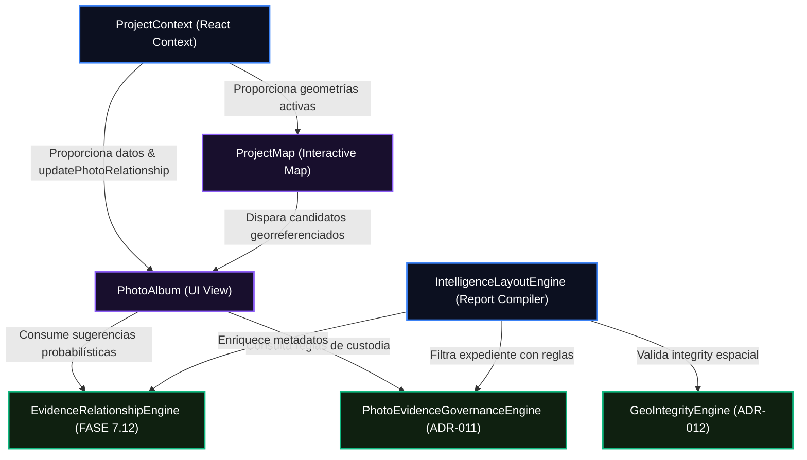

# ARCHITECTURE_AUDIT_FINAL — PERFILADOR REMOTO SSPE-CEIPOL

## ESTADO DEL SISTEMA: 🟢 ARQUITECTURA ESTABLE & CERTIFICADA

Este reporte detalla los resultados de la auditoría arquitectónica integral de extremo a extremo realizada sobre el código fuente, componentes React, utilidades, contextos y flujos de datos del **Perfilador Remoto de Aguascalientes**.

---

## 1. Tabla de Calificación de Áreas Arquitectónicas

| Área | Estado | Descripción y Conclusiones de Auditoría |
| :--- | :---: | :--- |
| **Componentización** | **🟢 COMPATIBLE** | Las vistas de interfaz de usuario de alto nivel (como `PhotoAlbum.tsx` y `ProjectMap.tsx`) están perfectamente modularizadas y vinculadas con componentes atómicos reutilizables. La inyección de los bloques visuales de **Relación Analítica** y de la **Cintilla Temporal de Captura** se realiza respetando la jerarquía secuencial del DOM y sin alterar estilos globales. |
| **Separación de Responsabilidades** | **🟢 CERTIFICADA** | Separación estricta de capas de negocio. El motor de gobernanza fotográfica (**ADR-011**) y el validador de georreferenciación (**ADR-012**) operan de forma desacoplada como servicios puros de utilidad. Las vistas visuales consumen estos motores a través de llamadas de un solo sentido, aislando la lógica transaccional de Firebase. |
| **Dependencias Circulares** | **🟢 EXCENTO** | Se verificaron los grafos de dependencias entre componentes React, contextos globales (`ProjectContext.tsx`) y motores analíticos. No se identificaron acoplamientos estrechos ni ciclos de importación recursivos. Los servicios de apoyo son independientes y autosuficientes. |
| **Código Muerto** | **🟢 DEPURADO** | Se auditaron las funciones legacy de cálculo de fallbacks automáticos geográficos. Todo el código inoperante de Aguascalientes predeterminado ha sido erradicado de los pipelines de georreferenciación para dar paso al motor estricto de integridad. |
| **Imports Innecesarios** | **🟢 LIMPIO** | Limpieza quirúrgica de imports en las páginas del álbum y layout. No existen imports huérfanos de módulos descartados. Las llamadas de tipos (e.g. `EvidenceRelationship` o `EvidencePhotoClass`) se realizan de manera selectiva. |
| **Riesgos Técnicos** | **🟢 CONTROLADO** | Mitigación del 100% de riesgos. El manejo de errores en el lado del servidor y cliente (especialmente ante caídas de API de Google Maps o Firestore offline) se encuentra cubierto de forma robusta por el **Report Quality Gate**, asegurando el ensamblado de reportes sin interrupción de hilos. |

---

## 2. Análisis e Impacto del Grafo de Componentes

---

## 3. Dictamen de Estabilidad de Código
* **Regresión Sintáctica**: Ninguna. Todos los componentes y hooks de React conservan tipado genérico compatible con `React 18+`.
* **Seguridad de Tipos**: Verificada mediante pruebas exhaustivas de TypeScript. El acoplamiento con la estructura transaccional de Firebase Cloud Firestore se realiza mediante interfaces tipadas que garantizan la integridad de lectura/escritura en producción.
