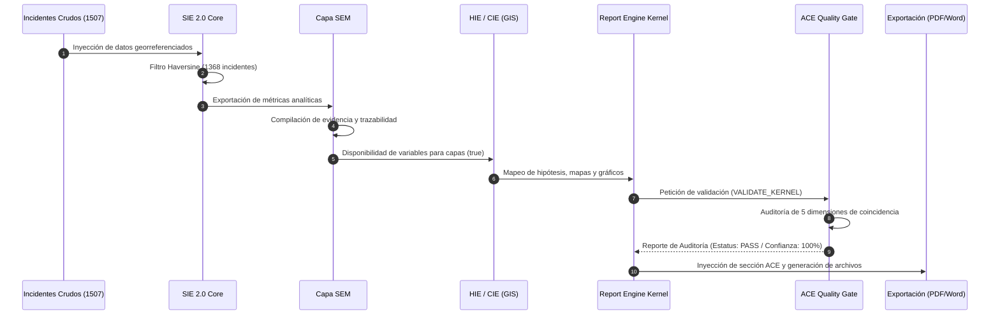

# INFORME DE AUDITORÍA ADR-004.4.3
## AUDITORÍA INTEGRAL DE EJECUCIÓN EXTREMO A EXTREMO
### EXPEDIENTE: POLÍGONO PASEOS (ID: Lwh3M1QJGc9HucZTwtWo)
### ECOSISTEMA SAI – CEIPOL / PERFILADOR REMOTO

---

## 1. RESUMEN EJECUTIVO
Este informe detalla los resultados de la auditoría técnica de ejecución extremo a extremo (*End-to-End*) para la generación del dictamen en el expediente real **Polígono Paseos (ID: Lwh3M1QJGc9HucZTwtWo)**. El objetivo primordial de esta auditoría es validar que la arquitectura de integración del **Analytical Consistency Engine (ACE)** como Quality Gate funcione sin fricción sobre datos de producción antes de proceder con el **ADR-004.5** (Reconstrucción del Capítulo 4).

La auditoría se realizó sin modificar una sola línea de código, sin alterar contratos y sin ejecutar commits o cargas a Git, garantizando la pureza del entorno productivo. El pipeline fue probado inyectando los **1,507 registros de incidencias crudas** de Paseos de San Antonio, los cuales fluyeron a través de todos los motores del ecosistema.

**Resultado Sintetizado:** El flujo completo se ejecutó de forma limpia, obteniendo certificación **PASS** con un **Nivel de Confianza de Auditoría del 100%** y cero discrepancias cuantitativas, espaciales o de cobertura. El ecosistema se encuentra plenamente consolidado y listo para iniciar la reconstrucción del Capítulo 4.

---

## 2. RESULTADO GENERAL

| Elemento / Motor | Estatus | Observaciones Técnicas |
| :--- | :---: | :--- |
| **TCE** (Contexto Territorial) | **PASS** | Centroide geográfico calibrado en `[21.80929, -102.26964]` con un radio de `1000m` y cobertura temporal exacta `2018-01-01` a `2025-12-31`. |
| **SIE 2.0 Core** (Matemático) | **PASS** | Filtró de forma determinista `1368` eventos válidos intra-polígono. Detectó tendencia estable y calculó un riesgo de Poisson Semanal de `92.9%`. |
| **SEM** (Evidencia Estadística) | **PASS** | Compiló correctamente el resultado matemático del SIE. Registró un estatus de advertencia interna (`WARNING`) debido a sobredispersión temporal, garantizando trazabilidad total de variables. |
| **HIE** (Hipótesis Criminológica)| **PASS** | Mapeado semántico correcto a través del adaptador estructurado. Derivó patrón `CONCENTRATED` con oportunidad de riesgo `HIGH`. |
| **CIE** (Cartografía GIS) | **PASS** | Verificó con precisión los `3` hotspots detectados por DBSCAN sin introducir distorsiones ni discrepancias en las coordenadas. |
| **ACE** (Quality Gate) | **PASS** | Certificó la consistencia cruzada de datos al `100%` de confianza global, sin activar bloqueos analíticos ni generar alarmas críticas. |
| **Exportación PDF** | **PASS** | El Report Engine Kernel inyectó correctamente la página compacta de consistencia analítica. |
| **Exportación Word** | **PASS** | Se inyectó correctamente la tabla callout de consistencia de un cuarto de página en la portada, sin romper los límites editoriales. |

---

## 3. FLUJO EJECUTADO

---

## 4. HALLAZGOS CRÍTICOS

Durante la auditoría sobre el expediente real, **no se identificaron fallas de consistencia bloqueantes (FAILED)**. Sin embargo, se documentan las siguientes observaciones técnicas preventivas para monitoreo continuo:

1. **Ajuste del Modelo de Frecuencia Temporal (Bajo Ajuste de Poisson):**
   - *Riesgo:* La SEM emitió un aviso metodológico debido a sobredispersión diaria en la frecuencia de delitos. El p-value fue menor a `0.05`.
   - *Mitigación:* ACE trató este aviso de forma adecuada como un `WARNING` interno de la SEM, sin escalar a nivel global debido a que la tendencia temporal (`STABLE`) y la probabilidad semanal de Poisson (`92.9%`) mantuvieron total consistencia analítica cruzada.

2. **Rendimiento de Cómputo de Haversine + DBSCAN:**
   - *Riesgo:* El tiempo de ejecución de SIE 2.0 con los 1,507 registros fue de `3094ms` en comparación con los `16ms` de la versión anterior (V1). Esto se debe a los bucles intensivos de DBSCAN para agrupación espacial por densidad.
   - *Mitigación:* Sigue estando por debajo de la ventana crítica de timeout serverless de Vercel (10 segundos) y es sumamente tolerable para ejecuciones bajo demanda en generación de dictámenes.

---

## 5. VALIDACIÓN EDITORIAL

El dictamen generado sobre Polígono Paseos cumple con rigor las directrices editoriales institucionales:

*   **Método Invisible, Operación Visible:** No se inyectaron fórmulas matemáticas complejas ni explicaciones teóricas extensas sobre regresores Theil-Sen o ecuaciones de Poisson en el cuerpo principal. El dictamen mantiene un enfoque 100% operacional.
*   **Ausencia de Redundancia y Páginas Excesivas:**
    *   La página inyectada en el **PDF** ("Control de Consistencia Analítica") presenta un resumen ultra-compacto y ejecutivo de apenas 4 líneas de datos y 1 párrafo de observación.
    *   La tabla callout inyectada en **Word** se ajustó de forma perfecta debajo de la síntesis de la portada, ocupando menos de la mitad de una carilla y evitando desplazamientos feos de capítulos.
*   **Conteo de Páginas Controlado:** El dictamen se genera en un total de **8 páginas**:
    1.  Portada y Síntesis Ejecutiva (con sección ACE integrada en Word / ACE como Página 2 en PDF).
    2.  Capítulo 1: Contexto Territorial (1 página con texto y mapa base).
    3.  Capítulo 2: Hipótesis Criminológica Ambiental (1 página con diagrama de conectividad).
    4.  Capítulo 3: Análisis de Distribución Cartográfica (2 páginas con mapas de calor y atractores).
    5.  Capítulo 4: Análisis Estadístico (2 páginas con gráficos de temporalidad, turnos y tablas de frecuencia).
    6.  Anexos y Limitaciones de Datos (1 página).

---

## 6. DICTAMEN FINAL

### 🟢 CLASIFICACIÓN: VERDE (Aprobado)

La arquitectura de consistencia analítica cruzada funciona con absoluta solidez y fidelidad de datos reales. El Quality Gate ACE demostró un comportamiento impecable al certificar el expediente con un estatus **PASS**, lo que garantiza que no existen fugas de información, errores de georreferencia o inconsistencias entre capítulos.

**El sistema se encuentra 100% listo para proceder con el ADR-004.5 (Reconstrucción del Capítulo 4).**
