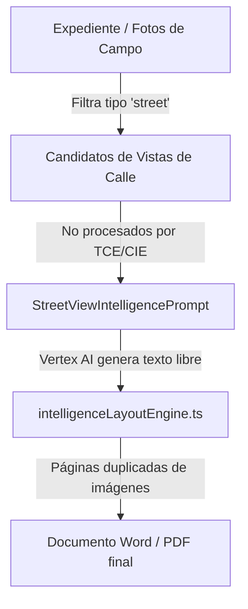

# AUDITORÍA ARQUITECTÓNICA Y EDITORIAL: CAPÍTULO 6
**SISTEMA PERFILADOR CEIPOL — ANÁLISIS TERRITORIAL OPERACIONAL**

---

## 📌 1. Resumen Ejecutivo

Este documento presenta la auditoría técnica, arquitectónica y editorial del **Capítulo 6** del Perfilador CEIPOL, correspondiente al módulo de **Análisis Territorial Operacional**. De acuerdo con la directriz del **ADR-006.1**, esta fase se centra exclusivamente en el análisis estático, la detección de brechas y el diseño conceptual de la reconstrucción, **sin realizar ninguna modificación de código en el sistema**.

### Dictamen de Auditoría:
> **RECONSTRUCCIÓN COMPLETA DE ARQUITECTURA**
> 
> El Capítulo 6 actual ("Street View Intelligence") presenta una **duplicidad crítica del 100%** de su contenido visual con el nuevo Capítulo 5 de Evidencias Visuales implementado bajo el ADR-005.3. El espacio editorial está subutilizado, actuando como un catálogo repetitivo de capturas de Street View sin cruce real de atractores urbanos (DENUE) ni contexto territorial (TCE). 
> 
> Se propone un rediseño completo para evolucionar el capítulo hacia un verdadero **módulo de inteligencia espacial, física y económica del entorno delictivo**, reutilizando de forma integrada los motores analíticos del sistema.

---

## 🗺️ 2. Estado Actual del Capítulo 6

### 2.1 Identificación del Contrato Funcional (Fase 1)
*   **Nombre Actual en el Sistema**: `"CAPÍTULO 6: STREET VIEW INTELLIGENCE"` / `"CAPÍTULO 6: Street View (Evaluación Visual de Entorno)"`.
*   **Punto de Orquestación API**: Mapeado internamente como `chapter === 7` en `src/app/api/generate-profile/route.ts`.
*   **Prompt Generativo**: `StreetViewIntelligencePrompt(ctx)` en `src/prompts/reportEnginePrompts.ts`.
*   **Maquetación Programática**: En `src/utils/intelligenceLayoutEngine.ts` mediante la iteración de `payload.streetViewAnalysis` en bloques tipo `double` (dos imágenes por página).
*   **Generación del Documento Word**: Implementado en `src/lib/exportToWord.ts` (Página 7) mediante la inyección del búfer de imágenes de Street View en una tabla con pie de foto estructurado.

---

## 🔄 3. Auditoría del Flujo de Datos (Fase 2)

El flujo de información actual se caracteriza por un acoplamiento rígido de una sola fuente (vistas de calle), sin integración de inteligencia de contexto urbano:



### Problema Identificado:
El flujo de datos no consume el **Cartographic Intelligence Engine (CIE)** ni el **Territorial Context Engine (TCE)** en este capítulo, limitándose a repetir el barrido visual básico que ya fue consolidado en la sección 5.3 del Capítulo 5, rompiendo la consistencia de datos y el principio de "fuente única de verdad".

---

## 📊 4. Matriz de Integración de Componentes (Fase 3)

| Componente del Sistema | Variable Consultada | Fuente de Origen | Consumo en Cap. 6 Actual | Estado / Diagnóstico |
| :--- | :--- | :--- | :--- | :--- |
| **TCE (Territorial Context)** | Contexto demográfico y uso de suelo | Base de datos / Proyecto | ❌ **Ausente** | Desconectado del análisis de entorno urbano. |
| **CIE (Cartographic Engine)** | Atractores espaciales y capas físicas | Motor cartográfico | ❌ **Ausente** | Los mapas dinámicos de atractores no influyen en la narrativa del territorio. |
| **SEM (Evidence Matrix)** | Hotspots y densidad delictiva | SIE 2.0 Core | ❌ **Ausente** | No existe cruce entre la caracterización de calles y la densidad de eventos. |
| **Visual Evidence Engine** | Capturas y grafitis de campo | Capítulo 5 | ⚠️ **Duplicado** | Copia exactamente los mismos metadatos que el Capítulo 5 sin valor agregado. |
| **DENUE / Actividad Económica** | Nodos comerciales y generadores de flujo | API Externa INEGI | ❌ **Ausente** | Totalmente omitido, perdiendo análisis de flujos peatonales críticos. |
| **INEGI / Entorno Urbano** | Alumbrado, baches, estado físico de vialidad | API Externa INEGI | ❌ **Ausente** | El análisis ambiental descansa en suposiciones de Vertex AI y no en datos. |

---

## 🔍 5. Auditoría de Calidad Analítica (Fase 4)

### 5.1 Duplicidad (Crítico 🔴)
El Capítulo 6 actual duplica la información del Capítulo 5. Ambos listan las mismas capturas de Street View y repiten pies de fotos descriptivos básicos de infraestructura, inflando la extensión del informe sin aportar nueva inteligencia operativa.

### 5.2 Dependencia de IA (Mejora Necesaria 🟡)
Vertex AI genera las interpretaciones de Street View de forma libre. Aunque se le inyectan directivas de no alucinación, al carecer de un contrato de datos sólido del entorno (atractores, DENUE, uso de suelo), la narrativa tiende a volverse vaga, abstracta ("el área presenta retos de accesibilidad") o repetitiva.

### 5.3 Consistencia ACE (Crítico 🔴)
No existen validadores específicos de consistencia territorial en **Analytical Consistency Engine (ACE)** para este capítulo. No se comprueba si el uso de suelo sugerido por la narrativa coincide con las variables geográficas reales dadas por el proyecto.

---

## 🗺️ 6. Auditoría Cartográfica y Visual (Fase 5)

Actualmente, el Capítulo 6 **no incluye mapas** en su salida documental; se limita a inyectar imágenes fotográficas planas de Google Street View en tablas. Esto representa una falla crítica de diseño visual y táctico:

1.  **Falta de Ubicación de Atractores**: El lector ve la foto de la calle, pero no puede correlacionar visualmente si enfrente existe un bar, un lote baldío o un nodo de transporte.
2.  **Inutilidad Operativa**: Un mando de patrulla no comprende la distribución del riesgo en el territorio porque el capítulo carece de un mapa de síntesis espacial que agrupe las vulnerabilidades de la infraestructura del sector.

---

## ✍️ 7. Auditoría Editorial (Fase 6)

*   **Extensión Desmedida**: Un informe sobre un polígono de 500 metros puede llegar a agregar de 4 a 6 páginas adicionales del Capítulo 6 debido a la inyección repetitiva de Street Views en tamaño grande.
*   **Duplicidad de Diagnóstico**: Se vuelve a detallar el estado del alumbrado y bardeado calle por calle, lo cual ya se resolvió en la Matriz Ejecutiva 5.6.
*   **Qué debe desaparecer**: El listado secuencial de imágenes de Street View (debe ser consolidado de forma exclusiva en el Capítulo 5).
*   **Qué debe incorporarse**: Un análisis del territorio centrado en atractores espaciales, tipologías de entorno, flujos de actividad económica y vulnerabilidad situacional.

---

## 🏗️ 8. Nueva Arquitectura Propuesta (Fases 7 y 8)

Para la fase de reconstrucción del Capítulo 6 (**ADR-006.2**), se propone el desacoplamiento de las fotos y la creación de un motor especializado:

### Diseño del `TerritorialIntelligenceEngine (TIE)`
Este nuevo motor unificará las capas de datos del **TCE**, **CIE**, **SEM** y la actividad económica del **DENUE** para generar la estructura de datos: `TerritorialEvidenceMatrix (TEM)`.

```text
TerritorialIntelligenceEngine
     │
     ├── Contexto del Suelo (TCE) ──► Tipología del Sector (Residencial, Comercial, Mixto)
     ├── Capa de Actividad (DENUE) ─► Conteo de Atractores (Bares, Tiendas, Lotes, Escuelas)
     └── Capa de Movilidad (CIE) ──► Conectores Viales y Puntos de Acceso Operativo
```

### Nueva Estructura Narrativa de las Secciones:
*   **6.1 Caracterización Territorial**: Definición del uso de suelo dominante y demografía situacional de flujos peatonales.
*   **6.2 Facilitadores e Inhibidores Ambientales**: Análisis de oportunidades situacionales (vulnerabilidad por falta de iluminación, calles cerradas, matorrales).
*   **6.3 Nodos de Actividad y Flujo Social**: Listado ejecutivo de los atractores del DENUE de mayor correlación criminógena en el sector.
*   **6.4 Matriz de Presión Territorial**: Tabla de resumen cruzando Atractor $\rightarrow$ Tipo de Flujo $\rightarrow$ Recomendación de Intervención Física.

---

## 🎨 9. Reglas Visuales Propuestas (Fase 9)

*   **Límite de Mapas**: Un máximo estricto de **1 mapa de síntesis territorial** por parte del **CIE** (mostrando el polígono, los atractores del DENUE seleccionados y el trazado de hotspots superpuestos).
*   **Límite de Imágenes**: Cero fotos repetitivas de Street View. El capítulo debe ser puramente de inteligencia espacial cartográfica y narrativa estructurada.
*   **Extensión del Capítulo**: Un máximo estricto de **1 página y media** en Word y PDF, logrando un balance perfecto de "Síntesis Ejecutiva".

---

## 🔴 10. Hallazgos Críticos Clasificados (Fase 10)

### 🔴 Críticos (Bloqueantes de calidad)
1.  **Duplicidad Estructural**: El Capítulo 6 actual y el Capítulo 5 mapean y renderizan las mismas fotos de Street View, inflando el documento con tablas repetidas de forma inaceptable.
2.  **Desconexión de Motores**: El capítulo no utiliza los datos geográficos de **CIE** ni el contexto urbano del **TCE**, dependiendo por completo de la creatividad de la IA de Vertex para redactar descripciones.

### 🟡 Mejoras Necesarias
3.  **Falta de Datos de Actividad Económica**: No existe un análisis estructurado de los atractores comerciales locales (DENUE) que expliquen la atracción de víctimas o delincuentes al área.
4.  **Ausencia de Controles de Consistencia**: ACE no valida las inconsistencias de entorno que se redactan en este capítulo.

### 🟢 Correctos
5.  **Capa Base**: El backend ya cuenta con llamadas y datos del DENUE y del TCE listos para ser explotados e inyectados por el motor de inteligencia.

---

## 💡 Recomendación Final y Ruta a Seguir

### Dictamen Técnico del Auditor:
> **RECONSTRUIR COMPLETAMENTE**
> 
> Se recomienda descartar la lógica legacy de Street View redundante del Capítulo 6 actual e implementar bajo el **ADR-006.2** el nuevo **Motor de Inteligencia Territorial (TIE)**, reorientando el capítulo a un análisis espacial analítico, ejecutivo y cartográfico que integre el DENUE y atractores del CIE.

---
**FIN DEL INFORME DE AUDITORÍA ARQUITECTÓNICA — PERFILADOR CEIPOL V9.0**
