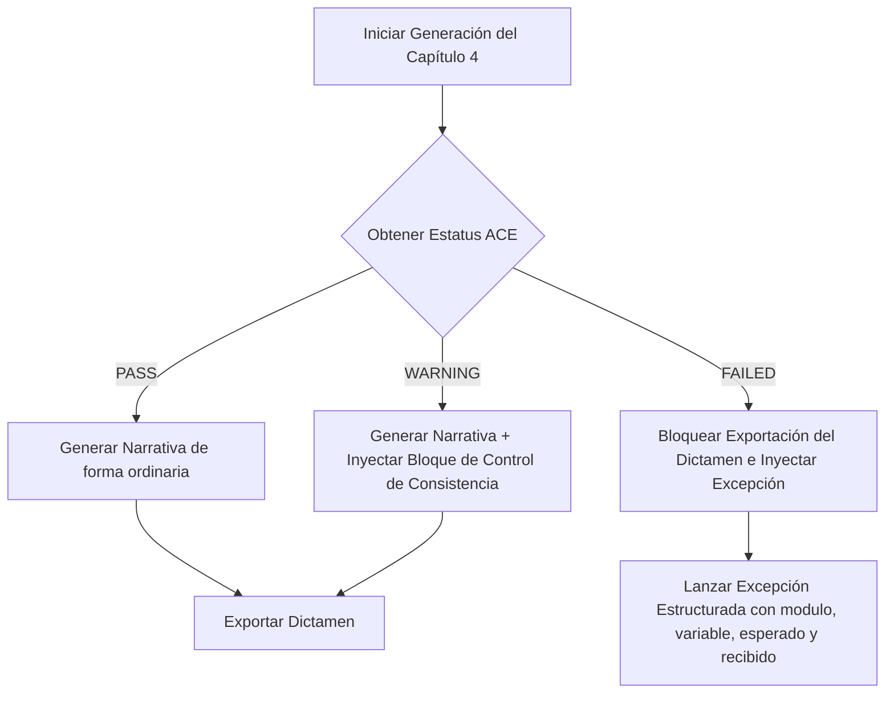

# ADR-004.5.2: PLANO ARQUITECTÓNICO Y EDITORIAL
## RECONSTRUCCIÓN DEL CAPÍTULO 4: ANÁLISIS ESTADÍSTICO DEL FENÓMENO DELICTIVO
### ECOSISTEMA SAI – CEIPOL / PERFILADOR REMOTO MMAS

---

## 1. OBJETIVO
El objetivo de este documento es definir el plano técnico, de consumo de datos y editorial definitivo para la reconstrucción completa del **Capítulo 4 (Análisis Estadístico del Fenómeno Delictivo)** del Perfilador Remoto. Este diseño erradica definitivamente el uso de métricas obsoletas de la versión anterior (V1), como las elipses de desviación estándar espacial, índices de aceleración lineal simple y cálculos desacoplados del flujo de datos, sustituyéndolos por un consumo unificado de la **Statistical Evidence Matrix (SEM)** y validación rigurosa del **Analytical Consistency Engine (ACE)**.

Este plano proporciona a cualquier desarrollador del equipo de CEIPOL las directrices y contratos exactos para realizar la implementación de código en la fase posterior (**ADR-004.5**), sin requerir interpretación de decisiones de diseño.

---

## 2. PRINCIPIOS DE DISEÑO

1.  **"Método Invisible, Operación Visible":** Queda estrictamente prohibido incluir fórmulas algebraicas, explicaciones conceptuales de algoritmos (como las ecuaciones de Poisson o la teoría de DBSCAN) y parámetros internos de calibración técnica. Toda la narrativa debe traducirse en hallazgos, patrones y recomendaciones de patrullaje táctico operativo en campo.
2.  **Consistencia Unidireccional y Trazabilidad:** El Capítulo 4 no calcula datos estadísticos por su cuenta. Consume de manera unívoca los datos numéricos certificados por la **SEM** y auditados por el **ACE**, eliminando el riesgo de discrepancias ("alucinaciones") entre el texto del dictamen y los mapas/gráficos del CIE.
3.  **Brevedad y Síntesis Editorial:** La narrativa del capítulo no debe exceder de **2 a 3 páginas**, separando por completo el texto de análisis puro de las láminas visuales de gráficos y mapas, los cuales fluyen como componentes independientes del maquetador editorial.

---

## 3. NUEVA ESTRUCTURA NARRATIVA DEL CAPÍTULO 4

El Capítulo 4 se estructurará de forma obligatoria en exactamente **cinco subapartados**, cada uno diseñado para responder una pregunta operativa de inteligencia:

### 4.1. Magnitud y Composición del Fenómeno
*   **Pregunta que responde:** ¿Qué magnitud tiene el fenómeno delictivo en el sector?
*   **Fuente de Datos:** `SEM.criminalEvidence`
*   **Variables clave a redactar:** Volumen total filtrado de incidentes georreferenciados válidos, desglose de los delitos predominantes (giros de alto impacto) y tasa de concentración de la tipología delictiva.
*   **Enfoque editorial:** Determinista y cuantitativo. Establece la línea base de la presencia criminal en el polígono.

### 4.2. Dinámica Temporal del Riesgo
*   **Pregunta que responde:** ¿Cuándo ocurre el delito y cómo evoluciona en el tiempo?
*   **Fuente de Datos:** `SEM.temporalEvidence`
*   **Variables clave a redactar:** Tendencia robusta no paramétrica de **Theil-Sen** (dirección y pendiente/slope), factores de estacionalidad mensual y semanal, ventanas horarias de máxima vulnerabilidad operativa y detección de picos de anomalías estadísticas históricas.
*   **Enfoque editorial:** Dinámico. Identifica el ritmo del delito y la "ventana de oportunidad" crítica para la planeación del patrullaje.

### 4.3. Concentración Espacial y Focalización Territorial
*   **Pregunta que responde:** ¿Dónde se concentra de forma prioritaria el fenómeno?
*   **Fuente de Datos:** `SEM.spatialEvidence` y coordenadas del `CIE`
*   **Variables clave a redactar:** Cantidad de hotspots densos identificados mediante el algoritmo adaptativo **DBSCAN**, coordenadas de baricentros de calor y tasa de concentración delictiva (ej. "el 65% de los delitos ocurren dentro del Hotspot 1").
*   **Enfoque editorial:** Táctico. Define de forma explícita las manzanas, corredores o intersecciones prioritarias para el despliegue de fuerza.

### 4.4. Escenario Predictivo y Probabilidad de Incidencia
*   **Pregunta que responde:** ¿Qué probabilidad existe de que el fenómeno se repita en el corto plazo?
*   **Fuente de Datos:** `SEM.predictiveEvidence`
*   **Variables clave a redactar:** Probabilidad semanal de repetición de incidentes mediante el modelo de distribución de **Poisson** (validado por la prueba Chi-Square de bondad de ajuste), índice de contagio espacio-temporal de **Near-Repeat** (proximidad y propagación en metros/días) y limitaciones técnicas explícitas de los datos.
*   **Enfoque editorial:** Probabilístico-estratégico. Advierte sobre riesgos inminentes de contagio territorial y la probabilidad estadística de eventos futuros bajo un nivel de confianza certificado.

### 4.5. Conclusión Estadística Operacional
*   **Pregunta que responde:** ¿Qué significa operativamente toda esta evidencia para la toma de decisiones?
*   **Fuente de Datos:** Correlación unificada de `SEM` + `ACE` + `HIE`
*   **Variables clave a redactar:** Contraste cruzado de la hipótesis criminológica del analista con la evidencia de los motores analíticos, validación de la confianza global calculada por el ACE, y traducción de los indicadores en recomendaciones de patrullaje, inteligencia táctica y mitigación de factores ambientales facilitadores.
*   **Enfoque editorial:** Directivo-táctico. Es la síntesis que justifica la acción en el territorio.

---

## 4. CONTRATO DE CONSUMO DE DATOS (SEM)

Para asegurar la rigidez del pipeline analítico, se define la siguiente matriz de variables consumidas por el generador de texto del Capítulo 4:

| Variable | Tipo | Fuente (Campo SEM) | Uso Editorial / Narrativo | Tipo de Visibilidad |
| :--- | :--- | :--- | :--- | :---: |
| `totalCanonicalEvents` | `number` | `SEM.totalCanonicalIncidents` | Redactar la magnitud total de la incidencia intra-polígono. | **Visible** |
| `predominantCrimes` | `Array` | `SEM.criminalEvidence.predominant` | Listar los 3 principales delitos con sus porcentajes de participación. | **Visible** |
| `entropyScore` | `number` | `SEM.criminalEvidence.entropy` | Determinar si el delito está diversificado o concentrado en un solo giro. | **Interna** (Guía la narrativa) |
| `trendDirection` | `string` | `SEM.temporalEvidence.trend` | Indicar la tendencia robusta (`STABLE`, `UPWARD`, `DOWNWARD`). | **Visible** |
| `theilSenSlope` | `number` | `SEM.temporalEvidence.theilSenSlope` | Explicar cuantitativamente la velocidad de aumento/disminución del delito. | **Interna** (Traducida a texto) |
| `criticalWindow` | `Object` | `SEM.temporalEvidence.criticalWindow` | Redactar el día y rango horario crítico de patrullaje preventivo. | **Visible** |
| `temporalAnomalies` | `Array` | `SEM.temporalEvidence.anomalies` | Identificar picos históricos específicos y descartar "ruido" de eventos únicos. | **Visible** |
| `dbscanHotspots` | `Array` | `SEM.spatialEvidence.hotspots` | Indicar el número de hiper-hotspots y su baricentro. | **Visible** |
| `spatialEntropy` | `number` | `SEM.spatialEvidence.spatialEntropy` | Calificar la dispersión geográfica (Concentración focalizada vs Dispersión). | **Interna** (Guía la narrativa) |
| `poissonWeeklyProb` | `number` | `SEM.predictiveEvidence.probability` | Redactar la probabilidad porcentual de ocurrencia de delitos la sig. semana. | **Visible** |
| `nearRepeatContagion` | `number` | `SEM.predictiveEvidence.nearRepeat` | Advertir el factor de contagio en el entorno (radio de riesgo extendido). | **Visible** |
| `poissonConfidence` | `number` | `SEM.predictiveEvidence.confidence` | Porcentaje de validez estadística del modelo Poisson (Chi-Square). | **Visible** (Nota técnica) |
| `aceGlobalStatus` | `string` | `ACE.globalStatus` | Incorporar el estatus de calidad técnica del dictamen (`PASS`, `WARNING`). | **Visible** (Nota de calidad) |
| `aceOverallConf` | `number` | `ACE.overallConfidence` | Reflejar el nivel de confianza de la auditoría en la conclusión. | **Visible** (Nota de calidad) |

---

## 5. DISEÑO DEL NUEVO PROMPT DE IA (`GraphAnalysisPrompt`)

El archivo `src/prompts/reportEnginePrompts.ts` debe reescribirse para implementar un **diseño puramente transformacional**. El LLM ya no actuará como motor de cálculo ni "adivinará" tendencias; se limitará a estructurar la información estructurada que recibe en prosa formal de nivel institucional.

### 5.1. Firma y Variables de Entrada del Prompt
```typescript
export const GraphAnalysisPrompt = (
  sem: StatisticalEvidenceMatrix, 
  aceReport: AnalyticalConsistencyReport, 
  hieVector: HIEValidationVector, 
  analysisRadius: number
): string => { ... }
```

### 5.2. Directrices del Sistema y Restricciones Anti-Alucinación (System Prompts)
1.  **Restricción de No-Cálculo:** El LLM tiene estrictamente prohibido sumar, restar, promediar o calcular deltas. Debe utilizar de forma exacta los números provistos en la SEM.
2.  **Restricción de No-Especulación:** No se deben inventar delitos, calles, nombres de pandillas o dinámicas delictivas que no figuren explícitamente en la SEM o en la hipótesis adaptada de HIE.
3.  **Regla de Evidencia Insuficiente:** Si `totalCanonicalIncidents` es `0` o menor a `5`, el LLM debe emitir obligatoriamente de forma exclusiva el siguiente texto en el capítulo: *"Evidencia estadística insuficiente para establecer una inferencia táctica con validez metodológica en el polígono seleccionado"*, omitiendo cualquier otro párrafo.
4.  **Estructura del Output:** El LLM debe responder con un Markdown estructurado que posea exactamente los encabezados `4.1`, `4.2`, `4.3`, `4.4` y `4.5` detallados en la Estructura Narrativa.

---

## 6. DISEÑO DE GRÁFICOS OPERATIVOS

Para cumplir con la directriz editorial de evitar gráficos decorativos, el nuevo Capítulo 4 integrará exactamente **tres gráficos de alta densidad analítica**:

### 6.1. Gráfico 1: Histograma de Frecuencia Temporal con Línea de Estacionalidad
*   **Nombre:** `TEMPORAL_SEASONAL_HISTOGRAM`
*   **Objetivo:** Responder a la pregunta: ¿Cuándo ocurre el delito y si el comportamiento actual sale de la norma estacional?
*   **Fuente de Datos:** `SEM.temporalEvidence`
*   **Variables Graficadas:** Frecuencia mensual de incidentes (barras azules) frente al índice de estacionalidad promedio (línea suavizada naranja) y umbral de anomalías (línea discontinua roja).
*   **Decisión que soporta:** Identificar si se requiere un despliegue preventivo estacional de largo plazo o si se trata de un pico anómalo temporal que requiere una intervención de contención inmediata.

### 6.2. Gráfico 2: Radar de Concentración Horaria y Ventana de Oportunidad
*   **Nombre:** `TACTICAL_OPPORTUNITY_RADAR`
*   **Objetivo:** Responder a la pregunta: ¿Cuáles son las horas y días exactos de máximo riesgo para la planeación del despliegue táctico?
*   **Fuente de Datos:** `SEM.temporalEvidence.criticalWindow` y turnos horarios.
*   **Variables Graficadas:** Gráfico radial de 24 horas y 7 días de la semana, donde el área del radar se ensancha en las horas de mayor coincidencia de incidentes.
*   **Decisión que soporta:** Planeación de turnos, horarios y asignación de cuadrantes de patrullaje dinámico para la Policía Preventiva.

### 6.3. Gráfico 3: Matriz de Calor de Concentración DBSCAN (CIE)
*   **Nombre:** `DBSCAN_HOTSPOT_HEATMAP`
*   **Objetivo:** Responder a la pregunta: ¿En qué manzanas exactas se concentra de forma prioritaria la mayor densidad de riesgo delictivo?
*   **Fuente de Datos:** `SEM.spatialEvidence.hotspots` y coordenadas de georreferenciación.
*   **Variables Graficadas:** Puntos calientes filtrados por radio de influencia Haversine, representados con degradados de densidad (de amarillo a rojo intenso) y etiquetas de prioridad de Hotspots (H1, H2, H3).
*   **Decisión que soporta:** Despliegue de patrullas fijas, puntos de control, cámaras de videovigilancia e intervenciones de recuperación de espacios públicos en entornos específicos.

---

## 7. DISEÑO DE INTEGRACIÓN ACE (QUALITY GATE)

El Analytical Consistency Engine (ACE) debe intervenir directamente en la maquetación editorial del Capítulo 4 según el estatus devuelto:



### 7.1. Representación Editorial de Advertencia (WARNING)
Si el estatus global del ACE es `WARNING` (por ejemplo, por una contradicción menor entre la estacionalidad diaria de la SEM y la hipótesis cualitativa del analista, o bajo ajuste del modelo estadístico de Poisson), se debe inyectar de forma obligatoria una **nota de control metodológico** justo al final de la portada en Word, u ocupar una página ejecutiva compacta en PDF:

> **[!] CONTROL DE CONSISTENCIA ANALÍTICA (ACE v1.0)**
> *   **Estatus:** ADVERTENCIA (Bajo Ajuste Estadístico Detectado).
> *   **Confianza Global de la Auditoría:** `85.0%`.
> *   **Nota Metodológica Institucional:** *"El modelo predictivo de repetición Poisson diaria presenta una desviación respecto a la hipótesis cualitativa de dispersión del analista. El tomador de decisiones debe guiar la planeación táctica utilizando la probabilidad semanal consolidada (92.9%), la cual mantiene un nivel de confianza estadística del 95%."*

---

## 8. REGLAS EDITORIALES OBLIGATORIAS

Para asegurar que el dictamen no pierda su valor operacional, se imponen las siguientes restricciones editoriales:

1.  **Límite de Extensión:** La narrativa del Capítulo 4 debe ocupar estrictamente de **2 a 3 páginas físicas** en total, incluyendo la conclusión operacional.
2.  **Aislamiento de Anexos:** Todos los mapas del CIE, las gráficas radiales e histogramas, y las evidencias de campo se maquetarán como láminas o anexos visuales. Ninguno de estos componentes visuales sumará páginas a la narrativa pura del capítulo.
3.  **Prohibición de Párrafos Académicos:** Quedan proscritas expresiones como *"el modelo DBSCAN (Density-Based Spatial Clustering of Applications with Noise)..."*, *"el estimador de Theil-Sen calcula la mediana de las pendientes..."*, o *"según la distribución de probabilidad de Siméon Denis Poisson..."*. El texto se redactará de forma táctico-operativa (ej. *"El análisis espacial identifica tres clusters de concentración aguda...", "La tendencia delictiva histórica se mantiene estable sin pendientes de aceleración...", "La probabilidad de incidencia es alta..."*).

---

## 9. IMPACTO ESTIMADO EN COMPONENTES DEL SISTEMA

Para la fase de implementación posterior (**ADR-004.5**), se anticipa el impacto y modificación de los siguientes archivos del repositorio:

1.  `src/prompts/reportEnginePrompts.ts`
    *   *Cambio:* Reconstruir por completo la firma y el contenido de `GraphAnalysisPrompt` para recibir `SEM`, `ACEPayload` e `HIEValidationVector` en sustitución del viejo objeto `sieData`.
2.  `src/lib/reportEngine.ts`
    *   *Cambio:* En la fase `VALIDATE_KERNEL` y `GENERATE_TEXT`, redirigir las tuberías de datos para inyectar la matriz `SEM` del administrador directamente en el prompt del Capítulo 4.
3.  `src/utils/intelligenceLayoutEngine.ts`
    *   *Cambio:* Refactorizar la construcción de las láminas visuales para maquetar el histograma estacional, el radar táctico de horas y el mapa de densidad DBSCAN de forma armonizada en las páginas del PDF.
4.  `src/lib/exportToWord.ts`
    *   *Cambio:* Reconstruir el generador dinámico de tablas de Word para el Capítulo 4, adaptando el renderizado de gráficos y el bloque de consistencia analítica ACE.

---

## 10. CRITERIOS DE ACEPTACIÓN PARA LA IMPLEMENTACIÓN (ADR-004.5)

El Capítulo 4 reconstruido se considerará completo y aprobado cuando cumpla con los siguientes tres criterios:

1.  **Cero Redundancia de Cómputo:** El frontend y el generador de texto no calculan métricas propias. Se consume el 100% de los datos pre-calculados en la SEM de forma síncrona.
2.  **Compilación y Calidad de Tipos (0 Errores):** El tipo de datos `statsText` y la firma de los prompts deben compilar con `npm run build` sin emitir advertencias de TypeScript.
3.  **Sincronía Certificada por ACE:** El Quality Gate del ACE debe certificar con estatus `PASS` y `100%` de confianza que los valores numéricos redactados en el texto coinciden con los representados en los mapas del CIE y en las tablas estadísticas del dictamen.
