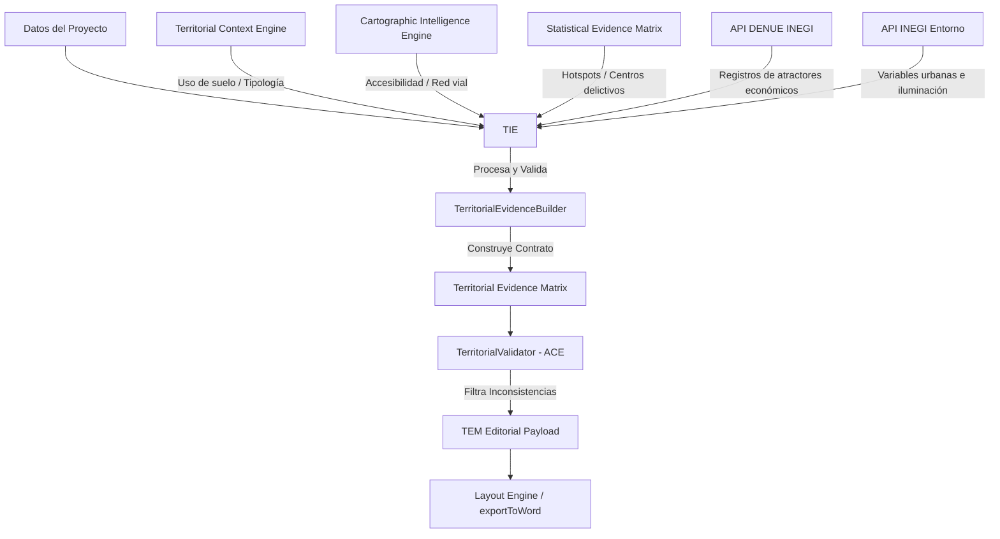

# PLAN DE DISEÑO ARQUITECTÓNICO: RECONSTRUCCIÓN DEL CAPÍTULO 6 (ADR-006.2)
**TERRITORIAL INTELLIGENCE ENGINE (TIE) — PERFILADOR CEIPOL**

---

## 📌 1. Resumen Ejecutivo

Este documento define las especificaciones, diagramas y contratos de datos para el nuevo **Territorial Intelligence Engine (TIE)** del Perfilador CEIPOL. Este motor asume la responsabilidad del **Capítulo 6 (Análisis Territorial Operacional)**, abandonando definitivamente el enfoque legacy de duplicar imágenes y descripciones de Google Street View (las cuales ahora pertenecen en su totalidad al Capítulo 5).

El motor unificará de manera analítica y determinista el contexto de suelo (**TCE**), los atractores del **DENUE**, la accesibilidad vial del **CIE** y la densidad delictiva calculada por el **SEM** para construir la **Territorial Evidence Matrix (TEM)**, la cual alimentará las narrativas de Vertex AI y los reportes en PDF y Word.

---

## 🏗️ 2. Flujo de Datos y Arquitectura de Integración

El **TIE** unifica múltiples motores y APIs externas en una sola matriz estructurada y validada:



---

## 📐 3. Contratos de Datos (Models)

Se creará el archivo `src/utils/territorialIntelligenceEngine/models/territorialEvidenceTypes.ts` con las siguientes interfaces TypeScript obligatorias:

```typescript
export interface EconomicAttractor {
  id: string;
  name: string;
  activityCode: string;
  category: "COMERCIO" | "ESCUELA" | "SERVICIO" | "PARQUE" | "TRANSPORTE" | "PUNTO_REUNION";
  address: string;
  distanceToHotspotMeters: number;
  influenceLevel: "HIGH" | "MEDIUM" | "LOW";
  criminologicalRole: string; // Explica el flujo, permanencia, concentración temporal
}

export interface UrbanStructure {
  landUse: string; // Residencial, comercial, mixto, industrial
  streetGridType: "GRID" | "ORGANIC" | "LINEAR" | "CUL_DE_SAC";
  vesselVulnerability: "HIGH" | "MEDIUM" | "LOW"; // Exposición por vías primarias/secundarias
  permeabilityScore: number; // 0-100, facilidad de escape/acceso
}

export interface MobilityFactor {
  transportNodeCount: number;
  mainAccessPoints: string[];
  vulnerabilityDescription: string;
  pedestrianExposure: "HIGH" | "MEDIUM" | "LOW";
}

export interface EnvironmentalRiskFactor {
  lightingScore: "SUFFICIENT" | "DEFICIENT" | "CRITICAL";
  visibilityObstructions: string[]; // vegetación, bardas continuas, matorrales
  abandonedLotsCount: number;
  structuralDeterioration: "HIGH" | "MEDIUM" | "LOW";
}

export interface OperationalImplication {
  directiveType: "PATROL_INCREASE" | "PHYSICAL_REMEDIATION" | "COMMUNITY_SURVEILLANCE" | "TACTICAL_POINT";
  locationReference: string; // Sanitizado: sin coordenadas numéricas
  rationale: string;
}

export interface TerritorialEvidenceMatrix {
  projectId: string;
  projectName: string;
  temVersion: string;
  territorialContext: {
    tipologyName: string;
    areaSizeMeters: number;
    description: string;
  };
  urbanStructure: UrbanStructure;
  economicAttractors: EconomicAttractor[];
  mobilityFactors: MobilityFactor;
  environmentalRiskFactors: EnvironmentalRiskFactor;
  operationalImplications: OperationalImplication[];
  traceability: {
    variablesQueried: string[];
    denueVersion: string;
    queryTimestamp: string;
  };
  confidence: {
    operationalConfidence: number; // 0-100
    evidenceSupportCount: number;
  };
  validationStatus: "VALIDATED" | "WARNING" | "FAILED";
}
```

---

## 📂 4. Estructura de Módulos Propuesta

Se creará la siguiente estructura de carpetas y archivos bajo `src/utils/territorialIntelligenceEngine/`:

```text
src/utils/territorialIntelligenceEngine/
│
├── index.ts                      # Exportaciones públicas de tipos y motor
├── territorialIntelligenceEngine.ts  # Orquestador del flujo y procesamiento
├── territorialEvidenceBuilder.ts # Ensamblador de la estructura TEM
├── attractorAnalyzer.ts          # Módulo de análisis y categorización de atractores del DENUE
├── urbanContextAnalyzer.ts       # Módulo para procesar usos de suelo, tramas y estructura
├── environmentalRiskAnalyzer.ts  # Módulo para analizar iluminación y factores de oportunidad
├── mobilityAnalyzer.ts           # Módulo para evaluar flujos peatonales y transporte
├── territorialValidator.ts       # Validador de consistencia territorial (ACE)
│
├── models/
│    └── territorialEvidenceTypes.ts  # Contratos e interfaces de datos
│
└── tests/
     └── territorialEngine.test.ts    # Suite de pruebas automatizadas
```

### Funciones Clave de los Módulos:
1.  **`attractorAnalyzer.ts`**: Clasifica la actividad económica local sin calificarla como origen delictivo. Identifica y mide la distancia métrica a los hotspots del **SEM** para determinar el nivel de influencia criminógena situacional (alta, media, baja).
2.  **`environmentalRiskAnalyzer.ts`**: Asocia factores de oportunidad situacional (vulnerabilidad por cerramientos continuos, lotes baldíos, baja visibilidad natural) con la probabilidad delictiva espacial.
3.  **`territorialValidator.ts`**: Implementa las validaciones del **ACE** específicas del territorio para corroborar la alineación entre la narrativa y los datos empíricos de atractores.

---

## 🔍 5. Integración con ACE (Analytical Consistency Engine)

El módulo `territorialValidator.ts` implementará tres validaciones estrictas en tiempo de ejecución:

*   **Validación 1 (Atractor Geo-Match)**: Corroborar que todos los atractores listados en la TEM se encuentren realmente dentro del área geográfica de análisis del polígono (radio métrico de influencia).
*   **Validación 2 (Cruce de Hotspots y Territorio)**: Validar que si la narrativa reporta "presencia de atractores escolares de alto flujo", exista efectivamente al menos un atractor clasificado como `ESCUELA` en la base de datos de la TEM.
*   **Validación 3 (Deduplicación de Coordenadas)**: Corroborar que ninguna latitud o longitud numérica pase de los atractores del DENUE o metadatos de Street View al texto final generado.

---

## ✍️ 6. Diseño Editorial del Capítulo 6

Para cumplir con el principio de *"análisis profundo y materialización ejecutiva"*, se define la siguiente estructura rígida de secciones:

*   **6.1 Caracterización Territorial**: Describe el tipo de territorio (residencial, comercial, mixto, industrial) y su conectividad urbana general.
*   **6.2 Estructura Urbana y Atractores**: Análisis táctico de los nodos económicos de mayor influencia situacional (conteo y clasificación basada en la TEM).
*   **6.3 Condiciones Ambientales del Entorno**: Diagnóstico físico (iluminación, matorrales, predios desocupados) que disminuye la vigilancia natural.
*   **6.4 Relación Territorio-Fenómeno**: Integración analítica cruzando atractores con la concentración delictiva de la **SEM**.
*   **6.5 Conclusión Operativa**: Directivas estratégicas y tácticas de patrullaje focalizado y remediación del entorno urbano.

---

## 🎨 7. Elementos Visuales y Reglas de Extensión

Para mantener la brevedad documental del dictamen, se definen los siguientes límites estrictos de contenido visual:

*   **1 Mapa Principal (CIE HD)**: Representación cartográfica en alta definición que fusiona:
    1.  Polígono de análisis.
    2.  Hotspots delictivos (isocronas de calor de **SEM**).
    3.  Ubicaciones geográficas de los atractores del DENUE seleccionados.
*   **2 Gráficos de Apoyo**:
    *   *Gráfico 1*: Distribución porcentual de atractores por categoría en el cuadrante de influencia.
    *   *Gráfico 2*: Matriz de presión territorial (atractor frente a nivel de influencia criminógena situacional).
*   **Fotos o Street Views**: **Totalmente Prohibido**. No se incluirá ninguna captura visual repetida en este capítulo.
*   **Límites de Páginas**: Un máximo estricto de **2 páginas** en formato de solo texto, y un máximo estricto de **4 páginas** cuando se inyectan el mapa y los dos gráficos de apoyo.

---

## 🚀 8. Plan de Implementación (Fase ADR-006.3)

La fase de desarrollo de código seguirá el siguiente orden lógico:

### Paso 1: Creación del Contrato de Datos
*   Escribir el archivo `territorialEvidenceTypes.ts` en la subcarpeta `models/`.

### Paso 2: Implementación de los Analizadores Auxiliares
*   Implementar `attractorAnalyzer.ts`, `urbanContextAnalyzer.ts`, `environmentalRiskAnalyzer.ts`, y `mobilityAnalyzer.ts`.

### Paso 3: Implementación del Builder y Orquestador
*   Implementar `territorialEvidenceBuilder.ts` para ensamblar la TEM de forma estructurada.
*   Implementar `territorialIntelligenceEngine.ts` como fachada única de cálculo.

### Paso 4: Creación de la Suite de Pruebas Unitarias (`tests/territorialEngine.test.ts`)
*   Escribir aserciones para validar el radio de atractores, la asignación de categorías, el bloqueo de coordenadas y la validación de consistencia.

### Paso 5: Modificación de la API Route y Prompts
*   Habilitar `chapter === 7` en `route.ts` para ejecutar el motor de inteligencia territorial.
*   Escribir un prompt analítico sumamente robusto centrado en la TEM y libre de alucinaciones espaciales en `reportEnginePrompts.ts`.

### Paso 6: Integración en Maquetación y Word Builder
*   Integrar en `intelligenceLayoutEngine.ts` y reescribir la sección en `exportToWord.ts` para dibujar la matriz táctica sin fotos.

---
**DISEÑO ARQUITECTÓNICO CONCLUIDO Y LISTO PARA EJECUCIÓN (ADR-006.2)**
