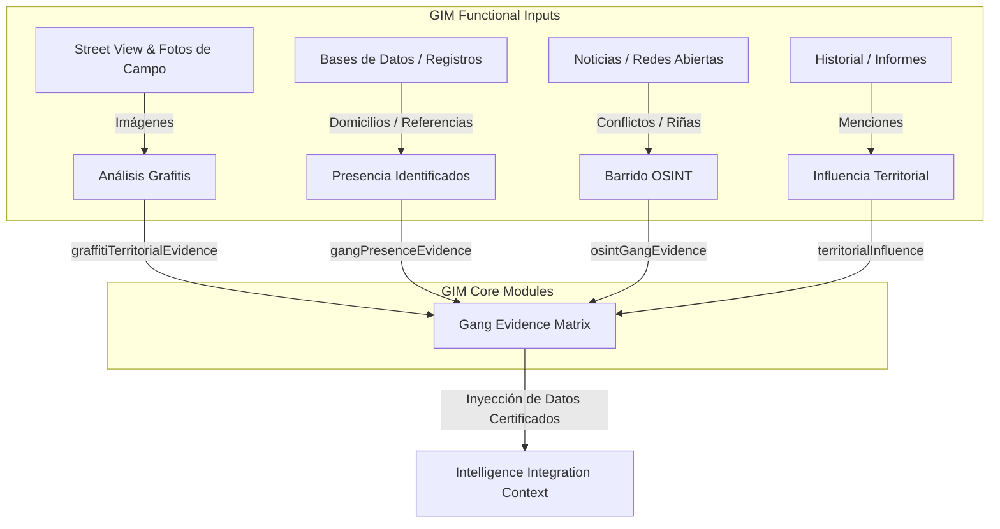

# ADR-008.1: DISEÑO ARQUITECTÓNICO DEL GANG INTELLIGENCE MODULE (GIM)
## Módulo de Inteligencia de Pandillas — Perfilador CEIPOL

---

## Estado del ADR
*   **Identificador:** `ADR-008.1`
*   **Título:** Diseño del Gang Intelligence Module (GIM)
*   **Estado:** 🟡 Propuesto para revisión (Pendiente de Aprobación)
*   **Relacionado con:** [ADR-007.3](file:///C:/Users/sadi7/OneDrive/Desktop/ECOSISTEMA%20SAI/PERFIL%20REMOTO/src/utils/intelligenceIntegrationContract/intelligenceContextBuilder.ts) (Migración IIC), [ADR-005.4](file:///C:/Users/sadi7/OneDrive/Desktop/ECOSISTEMA%20SAI/PERFIL%20REMOTO/src/utils/visualEvidenceEngine) (Visual Evidence Engine)

---

## 1. Alcance Funcional del Módulo (GIM)

El **Gang Intelligence Module (GIM)** tiene como objetivo capturar, estructurar y documentar indicios de dinámicas territoriales asociadas a grupos de atención especial o pandillas en el cuadrante de estudio. 

De acuerdo con el mandato de gobernanza y respeto a los derechos humanos del Perfilador CEIPOL, el módulo opera bajo **principios restrictivos de no-criminalización y no-atribución territorial absoluta**.

El análisis funcional se divide estrictamente en cuatro vertientes operativas:



### A. Presencia de Integrantes o Líderes Identificados
*   **Pregunta de Negocio:** ¿Existe evidencia documental (no inferida) de personas asociadas a grupos de atención especial con domicilio o referencia geográfica en el perímetro?
*   **Criterio Técnico:** No realiza mapeo de redes de vínculos criminales directas, solo registra la existencia de referencias documentales autorizadas o aportadas por el analista sobre ubicaciones específicas.

### B. Influencia Territorial Documentada
*   **Pregunta de Negocio:** ¿Qué grupos de atención especial han sido históricamente mencionados en reportes u OSINT dentro de la colonia o sector correspondiente?
*   **Criterio Técnico:** Queda terminantemente prohibido concluir control de terreno ("zona controlada por"). Se limita a registrar referencias documentadas de actividad o menciones.

### C. Análisis de Grafitis Territoriales
*   **Pregunta de Negocio:** ¿Los grafitis detectados presentan patrones simbólicos o marcas compatibles con identidad territorial de grupos de atención especial?
*   **Criterio Técnico:** La presencia de grafiti es un factor físico de vulnerabilidad del entorno, no una confirmación de presencia o control de pandillas. Solo la conjunción de *Grafiti observado + Elemento simbólico identificable + Coincidencia documental* puede derivar en una referencia territorial potencial.

### D. Barrido OSINT de Conflictos Colectivos
*   **Pregunta de Negocio:** ¿Existen noticias o reportes públicos en redes abiertas sobre riñas, enfrentamientos o amenazas colectivas asociadas a estos grupos en el área?
*   **Criterio Técnico:** Estructura eventos OSINT delimitados en tiempo y espacio, sin extrapolar dinámicas de violencia generalizadas.

---

## 2. Propuesta de Arquitectura de Archivos

Se creará el módulo de manera aislada y altamente estructurada bajo `src/utils/gangIntelligenceEngine/`:

```
src/utils/gangIntelligenceEngine/
│
├── models/
│    └── gangIntelligenceTypes.ts         # Contratos de tipos y esquemas TypeScript
│
├── gangEvidenceBuilder.ts                # Orquestador de armado de la GangEvidenceMatrix (GEM)
│
├── gangEvidenceValidator.ts              # Validador ético/técnico de lenguaje y confianza
│
├── graffitiTerritorialAnalyzer.ts        # Analizador de compatibilidad de grafiti y marcas
│
├── gangOsintAnalyzer.ts                  # Parser de riñas, conflictos y fuentes públicas
│
├── gangIntelligenceEngine.ts             # Punto de entrada y procesamiento del motor
│
├── index.ts                              # Exportaciones públicas del módulo
│
└── tests/
     └── gangIntelligence.test.ts         # Suite completa de pruebas unitarias (5 casos)
```

---

## 3. Contratos de Datos (Modelos)

### `src/utils/gangIntelligenceEngine/models/gangIntelligenceTypes.ts`

```typescript
export interface GangPresenceEvidence {
  status: "CONFIRMED" | "REFERENCED" | "NO_EVIDENCE";
  confidence: number; // Porcentaje de confianza 0 - 100
  sourceType: "OFFICIAL_RECORD" | "ANALYST_INPUT" | "OSINT_VALIDATED" | "NONE";
  description: string; // Resumen descriptivo formal libre de lenguaje criminalizante
}

export interface TerritorialInfluence {
  gangName: string;
  evidenceLevel: "HIGH" | "MEDIUM" | "LOW";
  evidenceSources: string[];
  limitations: string[];
}

export interface GraffitiTerritorialEvidence {
  detected: boolean;
  possibleTerritorialMarkers: boolean;
  evidenceCount: number;
  confidence: number;
  details: Array<{
    photoId: string;
    source: "STREET_VIEW" | "ANALYST_PHOTO";
    hasSimbology: boolean;
    suspectedGroup?: string;
    description: string;
  }>;
}

export interface OsintGangEvidence {
  date: string;
  source: string;
  eventType: "RIÑA" | "AMENAZA" | "ENFRENTAMIENTO" | "REFERENCIA_GENERAL";
  territorialRelation: "DIRECT" | "INDIRECT" | "NONE";
  confidence: number;
  description: string;
}

export interface GangEvidenceMatrix {
  metadata: {
    projectId: string;
    generatedAt: string;
    version: string;
  };

  presenceEvidence: GangPresenceEvidence;
  territorialInfluence: TerritorialInfluence[];
  graffitiEvidence: GraffitiTerritorialEvidence;
  osintEvidence: {
    eventsFound: number;
    events: OsintGangEvidence[];
    confidence: number;
  };

  limitations: string[];
  provenance: {
    sources: string[];
    generatedAt: string;
  };
}
```

---

## 4. Reglas Editoriales y de Lenguaje Seguro

> [!IMPORTANT]
> ### 4.1 Principio de No-Criminalización
> Queda terminantemente prohibido el uso de términos absolutistas, estigmatizantes o interpretaciones de control delictivo no validadas judicialmente.

### Vocabulario Prohibido y Sustitutos Institucionales:

| Expresión Prohibida (Bloqueo de Validación) | Sustituto Institucional Aprobado |
| :--- | :--- |
| "Zona controlada por la pandilla X" | "Área con referencias documentales de presencia/actividad asociada al grupo X" |
| "Territorio de la clica Y" | "Sector geográfico con indicios de tránsito o marcadores simbólicos vinculados a Y" |
| "Pertenece a la pandilla X" | "Sujeto con registros compatibles de asociación o referencia histórica al grupo X" |
| "Miembro criminal confirmado" | "Persona registrada de interés o con antecedentes de pertenencia documentados por la autoridad" |

---

## 5. Validador Obligatorio: `gangEvidenceValidator.ts`

Este componente inspecciona de manera determinista la `GangEvidenceMatrix` construida y el texto que se pretenda exportar.

### Funciones Críticas del Validador:
1.  **`validateEditorialLanguage(text: string): { isValid: boolean; forbiddenWord?: string }`**
    *   Inspecciona mediante expresiones regulares la presencia de términos prohibidos (ej: `/territorio de|zona controlada por|pertenece a/gi`).
    *   Si detecta un término prohibido, la validación falla para alertar al `Report Engine` (disparando una alerta de tipo `ACE WARNING` o bloqueando la exportación según gravedad).
2.  **`evaluateConfidenceLevels(matrix: GangEvidenceMatrix): "READY" | "READY_WITH_LIMITATIONS" | "NOT_READY"`**
    *   Si los datos acumulados de OSINT o presencia oficial poseen un nivel de confianza bajo (`confidence < 40`), el validador forzará el estado del reporte a **`READY_WITH_LIMITATIONS`**.
    *   La matriz agregará automáticamente advertencias metodológicas al arreglo de `limitations` para advertir al lector sobre la naturaleza indicativa de los datos.

---

## 6. Integración Futura con el IIC

De acuerdo con el dictamen de arquitectura del **ADR-007.4**, no se permiten flujos alternativos hacia el Report Engine. La `GangEvidenceMatrix` (GEM) se acoplará de la siguiente forma:

1.  **Actualización de Estatus de Capacidades:**
    *   En `src/utils/intelligenceIntegrationContract/models/intelligenceContextTypes.ts`, la propiedad `capabilityStatus.gangIntelligence` y `intelligenceModules.gang` pasarán a ser alimentados por la presencia real de la GEM.
2.  **Modificación del Contexto de Integración:**
    *   Se agregará `GIM` bajo `evidenceSources` dentro de la interfaz `IntelligenceIntegrationContext`:
    ```typescript
    export interface IntelligenceIntegrationContext {
      // ... anteriores fuentes (SEM, VEE, TIE, HIE, ACE)
      evidenceSources: {
        SEM: StatisticalEvidenceMatrix;
        VEE: VisualEvidenceMatrix | null;
        TIE: TerritorialEvidenceMatrix | null;
        HIE: HIEValidationVector | null;
        CIE: any | null;
        ACE: AnalyticalConsistencyEngine;
        GIM: GangEvidenceMatrix | null; // Nuevo Módulo GIM de Pandillas
      };
    }
    ```

---

## 7. Planificación de Pruebas Unitarias (Suite GIM)

Se definen 5 escenarios de prueba obligatorios que deberán codificarse en `tests/gangIntelligence.test.ts`:

### Caso 1: Expediente Sin Evidencia de Pandillas
*   **Entrada:** Listas de OSINT vacías, sin grafitis en el expediente, sin referencias documentales.
*   **Resultado Esperado:** La matriz GEM se construye con estatus `"NO_EVIDENCE"`, y el validador aprueba el contexto como **`READY_WITH_LIMITATIONS`** indicando que el polígono carece de marcadores de pandillas, sin bloquear la exportación editorial del resto de capítulos.

### Caso 2: Integrante/Líder Referenciado
*   **Entrada:** Registro documental válido inyectado por el analista.
*   **Resultado Esperado:** Estatus cambia a `"REFERENCED"`, confianza se establece en `100` (ya que es input humano institucional), procedencia registra `"ANALYST_INPUT"`.

### Caso 3: Grafitis Territoriales Detectados
*   **Entrada:** Entrada de 3 registros fotográficos del Visual Evidence Engine que contienen la etiqueta `"graffiti"` y texto compatible con simbología conocida de agrupaciones locales.
*   **Resultado Esperado:** El `graffitiTerritorialAnalyzer` detecta los patrones, establece `detected: true` y `possibleTerritorialMarkers: true`, pero calcula una confianza moderada (`50%`), registrando las limitaciones de que la presencia de grafiti es indicativa y no confirma de forma inequívoca el control del polígono.

### Caso 4: Barrido OSINT de Riñas o Enfrentamientos
*   **Entrada:** Dos noticias públicas indexadas por el crawler que mencionan riñas colectivas de pandillas en el cuadrante.
*   **Resultado Esperado:** El módulo `gangOsintAnalyzer` extrae, estructura y tipifica correctamente los eventos como `"RIÑA"`, calculando una relación territorial `"DIRECT"` o `"INDIRECT"` con base a la proximidad en metros de las calles citadas.

### Caso 5: Mitigación de Inferencia Automática (Intento de Infracción)
*   **Entrada:** Un fragmento de texto simulado que genera VertexAI o un analista que reza: *"La zona investigada es territorio controlado por la pandilla de Los 13"*.
*   **Resultado Esperado:** El método `validateEditorialLanguage` de `gangEvidenceValidator` detecta la transgresión de términos prohibidos, rechaza el texto y activa una alerta crítica en la consistencia de calidad analítica.

---

## 8. Limitaciones Metodológicas Certificadas
Cada informe que integre datos del GIM incluirá de forma automática las siguientes leyendas de descargo metodológico:
1.  *"La georreferenciación de grafitis o la citación de conflictos OSINT representa actividad física o documental histórica registrada en el entorno, y no constituye prueba de autoría criminal de los habitantes del cuadrante."*
2.  *"Las referencias a personas asociadas a agrupaciones de atención especial responden a bases de datos de interés operativo sujetas a actualización y depuración constante por las autoridades correspondientes."*

---
*Fin del Diseño de Arquitectura ADR-008.1*
