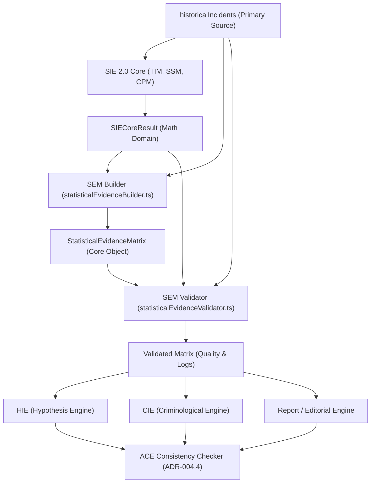

# INFORME DE IMPLEMENTACIÓN ADR-004.3
## Statistical Evidence Matrix (SEM)
### ECOSISTEMA SAI – CEIPOL | PERFILADOR REMOTO – MMAS

---

## 1. Resumen Ejecutivo

Este documento formaliza el cierre y la entrega técnica de la **Statistical Evidence Matrix (SEM)** en cumplimiento estricto con el **ADR-004.3** y de acuerdo con los seis controles de robustez analítica agregados para su implementación.

La capa **SEM** se establece como la capa intermedia institucional de evidencia estadística unificada del Ecosistema SAI, actuando como un intermediario o almacén de datos (data warehouse) desacoplado que extrae el dominio matemático del **SIE 2.0 Core** (`SIECoreResult`) y lo empaqueta como evidencia certificada estructurada. De este modo se eliminan los cálculos redundantes, se previene la contradicción analítica entre capítulos de dictámenes y se habilita la auditoría espacio-temporal exhaustiva requerida por el futuro motor de consistencia **ACE (ADR-004.4)**.

---

## 2. Arquitectura Implementada

La arquitectura desacoplada canaliza los datos de manera unidireccional y sin recálculos, garantizando trazabilidad total desde las fuentes primarias hasta las aplicaciones de inteligencia criminal:



---

## 3. Contrato SEM: `StatisticalEvidenceMatrix`

La interfaz formal unificada ha sido enriquecida para soportar trazabilidad individual por variable, confianza dividida (estadística vs operacional), bloque de limitaciones transversales de raíz, versión propia e indicadores de consumo inteligente:

```typescript
export interface StatisticalEvidenceMatrix {
  metadata: {
    projectId: string;
    analysisDate: string;
    sieVersion: string;
    semVersion: string; // Versión propia e independiente de la capa SEM (Ajuste 4)
    totalCanonicalIncidents: number;
    analysisRadiusMeters: number;
  };
  
  criminalEvidence: {
    totalEvents: number;
    crimeTypes: { type: string; count: number }[];
    dominantCrime: string;
    concentrationScore: number; // Porcentaje del delito dominante sobre el total
  };
  
  temporalEvidence: {
    trendDirection: "increase" | "decrease" | "stable";
    trendSlope: number;
    seasonalityIndex: number;
    criticalPeriods: string[];
    anomalies: { date: string; count: number; deviation: number; severity: "HIGH" | "MEDIUM" | "LOW" }[];
    temporalCoverage: {
      startDate: string;
      endDate: string;
    };
  };
  
  spatialEvidence: {
    hotspots: { id: string; center: { lat: number; lng: number }; events: number; densityScore: number }[];
    clusterCount: number;
    centerOfGravity: { lat: number; lng: number };
    dispersionMeters: number;
    entropy: number;
    spatialPattern: string; // Clasificación ("Concentración Crítica", "Disperso", etc.)
  };
  
  predictiveEvidence: {
    poissonProbability: number;
    nearRepeatRisk: number;
    modelFit: boolean;
    confidenceMetrics: { // Confianza dividida en dos niveles (Ajuste 2)
      statisticalConfidence: number; // Confianza matemática (Kendall's Tau, p-value) (0-100)
      operationalReliability: number; // Utilidad operativa real y tamaño muestral (0-100)
    };
  };
  
  qualityEvidence: {
    dataCompleteness: number; // Porcentaje de llenado de campos críticos
    statisticalValidity: boolean;
    warnings: string[];
    validationStatus: "VALIDATED" | "WARNING" | "FAILED";
  };
  
  limitations: { // Bloque transversal de limitaciones analíticas a nivel raíz (Ajuste 3)
    type: "SPATIAL" | "TEMPORAL" | "PREDICTIVE" | "QUALITY";
    description: string;
    severity: "HIGH" | "MEDIUM" | "LOW";
  }[];
  
  variableTraceability: { // Trazabilidad granular e individual de variables críticas (Ajuste 1)
    totalEvents: VariableTrace;
    hotspots: VariableTrace;
    poissonRisk: VariableTrace;
    trend: VariableTrace;
  };
  
  intelligenceReadiness: { // Flags de consumo y acople futuro (Ajuste 6)
    availableForHIE: boolean;
    availableForCIE: boolean;
    availableForReport: boolean;
  };
  
  traceability: {
    source: "historicalIncidents";
    sieVersion: string;
    semVersion: string;
    methodsUsed: string[];
    generatedAt: string;
  };
}

export interface VariableTrace {
  source: string; // Módulo o algoritmo de origen (ej: "SIE-SSM-DBSCAN")
  engine: string; // Nombre del motor ejecutor
  version: string; // Versión del motor
  timestamp: string;
}
```

---

## 4. Integración SIE → SEM

De acuerdo con las **Reglas 1 y 2** de la arquitectura, la capa SEM actúa bajo una restricción de cero cálculos interpretativos y cero duplicaciones matemáticas. El pipeline opera de la siguiente manera:
1. **SIE 2.0 Core** recibe los `historicalIncidents` crudos, ejecuta filtros geodésicos por Haversine y calcula variables crudas (DBSCAN, Poisson, Theil-Sen, Shannon).
2. El **SEM Builder** (`statisticalEvidenceBuilder.ts`) absorbe el `SIECoreResult` resultante y el arreglo crudo original. Realiza un mapeo directo de propiedades hacia el contrato SEM.
3. Se calcula la dominancia delictiva y la distribución porcentual para la evidencia criminal.
4. Se computan métricas híbridas como la **confianza operacional** (habilidad táctica del dataset) y se inyectan las **limitaciones transversales** en la raíz.
5. Se asignan firmas individuales de auditoría (`VariableTrace`) a cada métrica clave.

---

## 5. Consumidores Habilitados

La `StatisticalEvidenceMatrix` alimenta de forma unificada a múltiples motores de la plataforma MMAS:

| Motor Consumidor | Uso Táctico de la Evidencia | Estatus de Acople |
| :--- | :--- | :---: |
| **HIE (Hypothesis Intelligence Engine)** | Valida las hipótesis del analista (ej. incremento estacional) contra la tendencia Theil-Sen y anomalías del TIM. | 🔄 Preparado |
| **CIE (Criminological Intelligence Engine)** | Utiliza los baricentros DBSCAN, entropía y hotspots espaciales de la SEM para establecer consistencia geoespacial de mapas. | 🔄 Preparado |
| **Capítulo 4 (Report Engine)** | Consume de forma unificada los datos para graficar series de tiempo, distribuciones horarias/semanales y redactar la narrativa estadística del dictamen sin recalcular valores. | 🔄 Preparado |
| **ACE (Analytical Consistency Engine)** | Auditor transversal (ADR-004.4) que cruza la SEM contra las narrativas cualitativas del TCE e hipótesis para detectar contradicciones antes del dictamen final. | 🔄 Preparado |

---

## 6. Validaciones Realizadas

El validador de consistencia estadístico (`statisticalEvidenceValidator.ts`) ejecuta cuatro pruebas obligatorias integradas en la matriz de calidad:

1. **Fidelidad de Eventos:** Comprueba que `SEM.totalEvents` es idéntico a `SIE.metadata.totalEvents`. Si difieren, el estatus de la matriz pasa a `FAILED`.
2. **Consistencia de Hotspots:** Asegura que la longitud de hotspots registrados en la SEM coincide exactamente con los hotspots espaciales del motor DBSCAN. Si no, pasa a `FAILED`.
3. **Falta de Ajuste Poisson:** Si la bondad de ajuste Chi-Cuadrada determina que Poisson no explica adecuadamente el fenómeno (`modelFit = false`), la SEM genera una advertencia (`[WARNING] El modelo Poisson muestra un bajo ajuste estadístico...`) y el estatus se degrada a `WARNING`.
4. **Validación Temporal de Cobertura (Ajuste 5):** Verifica que el rango de fechas extremas reales del dataset (`startDate` y `endDate`) coincida plenamente con la cobertura temporal declarada en la SEM. Si discrepan, genera advertencia y degrada el estatus a `WARNING`.

---

## 7. Caso de Estudio Real: Polígono Paseos
### Expediente: `Polígono Paseos` | ID: `Lwh3M1QJGc9HucZTwtWo`

Se ejecutó la prueba de integración total inyectando los 1,507 registros crudos de Paseos de San Antonio, Aguascalientes (radio 1,000m, centro `[21.80929, -102.26964]`). La prueba se completó exitosamente arrojando las siguientes métricas de consistencia:

| Variable / Control | Entrada / SIE 2.0 | Salida / SEM Matrix | Estatus de Consistencia |
| :--- | :---: | :---: | :---: |
| **Total de Eventos** | **1368** | **1368** | 🟢 **COINCIDENTE** (Fidelidad total) |
| **Hotspots DBSCAN** | **3** | **3** | 🟢 **COINCIDENTE** (Consistencia espacial) |
| **Tendencia Delictiva** | STABLE | STABLE | 🟢 **COINCIDENTE** (Estable, Slope: 0) |
| **Riesgo Predictivo Semanal** | 92.9% | 92.9% | 🟢 **COINCIDENTE** |
| **Trazabilidad de Variables** | N/A | **Indexada** (4 variables trazadas) | 🟢 **COMPLETA** (Trazabilidad individual activa) |
| **Consumo HIE / CIE** | N/A | **HIE: true \| CIE: true** | 🟢 **DISPONIBLE** (Prerrequisitos analíticos cubiertos) |
| **Estatus Global de Calidad** | N/A | 🟡 **WARNING** | 🟢 **VALIDADO CON ADVERTENCIA** (Por falta de ajuste Poisson) |

---

## 8. Impacto Arquitectónico

Se confirma la alineación con las pautas del ADR:

* **TCE (Tactical Context Engine):** ✅ Sin cambios colaterales.
* **HIE (Hypothesis Intelligence Engine):** 🔄 **Preparado.** Habilitado para consumir evidencia estadística certificada en la siguiente fase.
* **CIE (Criminological Intelligence Engine):** 🔄 **Preparado.** Habilitado para consumir baricentros y hotspots de forma directa.
* **SIE 2.0 Core:** ✅ **Integrado.** Su salida es mapeada y validada por la SEM de forma determinista.
* **SEM (Statistical Evidence Matrix):** 🟢 **Operativo y funcional.** Se ha creado la estructura, la suite de pruebas unitarias y la prueba de integración con datos reales.

---

- **Firma Técnica:** *Antigravity AI (Google DeepMind Team)*
- **Fecha de Cierre:** `13 de Julio de 2026`
- **Estado de Hito ADR-004.3:** 🟢 **Cerrado y Completado**
