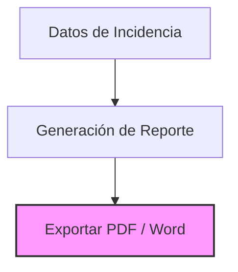
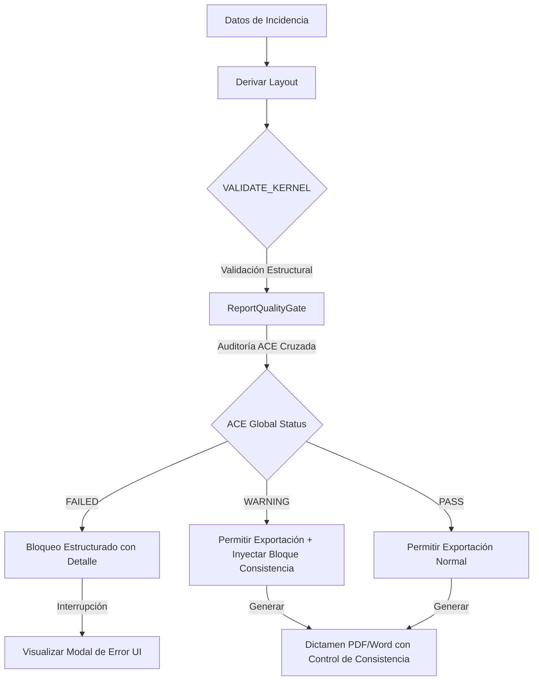

# INFORME DE IMPLEMENTACIÓN: ADR-004.4.2
## INTEGRACIÓN DE ANALYTICAL CONSISTENCY ENGINE (ACE) COMO QUALITY GATE
### ECOSISTEMA SAI – CEIPOL / PERFILADOR REMOTO

---

## 1. RESUMEN DE LA IMPLEMENTACIÓN
Este documento detalla la integración final del **Analytical Consistency Engine (ACE)** como el **Quality Gate** de consistencia definitivo en el **Report Engine Kernel** de la plataforma Perfilador Remoto.

Esta fase se completó de manera no intrusiva:
- **Sin recalcular ni modificar datos** de los motores base (TCE, SIE 2.0, SEM, HIE o CIE).
- **Únicamente auditando** la coherencia técnica y analítica cruzada.
- **Implementando un control robusto de calidad**: bloqueando exportaciones corruptas (`FAILED`) y adaptando el dictamen con observaciones institucionales estratégicas para advertencias menores (`WARNING`).

---

## 2. ARQUITECTURA DE FLUJO: ANTES Y DESPUÉS

### Flujo Original (Antes de ACE)

*Problema:* Errores de sincronización, desplazamientos espaciales de mapas o contradicciones cualitativas entre hipótesis y estadísticas no se validaban de forma cruzada, generando dictámenes con discrepancias de datos.

### Flujo Integrado (Con ACE Quality Gate)


---

## 3. ARCHIVOS MODIFICADOS Y CREADOS

### 3.1. Nuevos Componentes
1. **[HIEValidationVectorAdapter](file:///C:/Users/sadi7/OneDrive/Desktop/ECOSISTEMA%20SAI/PERFIL%20REMOTO/src/utils/analyticalConsistencyEngine/hieValidationVectorAdapter.ts)** `[NEW]`
   - *Propósito:* Adaptador que extrae semántica de la hipótesis cualitativa de texto libre y descripción de proyecto del HIE, mapeándolos en un vector estructurado `HIEValidationVector` (`spatialPattern`, `temporalPattern`, `criticalOpportunity`). Esto previene que el core del ACE analice texto crudo, protegiendo al motor de inconsistencias de procesamiento de lenguaje natural.

### 3.2. Archivos Modificados
2. **[reportEngine.ts](file:///C:/Users/sadi7/OneDrive/Desktop/ECOSISTEMA%20SAI/PERFIL%20REMOTO/src/lib/reportEngine.ts)** `[MODIFY]`
   - *Cambios:*
     - Importación de los módulos de ACE y SEM.
     - En la transición `VALIDATE_KERNEL` del `ReportEngineKernelClass`:
       - Ejecución secuencial después de las validaciones de anexos seleccionados.
       - Construcción automática de `ACEPayload` a partir del contexto del proyecto, mapas y la matriz SEM generada dinámicamente.
       - Evaluación y bloqueo en caso de `FAILED` mediante el lanzamiento de un error estructurado no genérico que detalla el módulo, la variable, el valor esperado y el recibido.
       - Inyección de una página ejecutiva dinámica `"Control de Consistencia Analítica"` en `briefing.pages` si el estatus de ACE es `WARNING` o `PASS` con alertas, asegurando su renderizado compacto en el PDF.
3. **[exportToWord.ts](file:///C:/Users/sadi7/OneDrive/Desktop/ECOSISTEMA%20SAI/PERFIL%20REMOTO/src/lib/exportToWord.ts)** `[MODIFY]`
   - *Cambios:*
     - Incorporación de una sección compacta y visualmente atractiva (callout box con bordes de color condicionales: naranja para advertencias, verde para validado) que detalla el control de consistencia, confianza del ACE y observaciones metodológicas directamente debajo de la síntesis ejecutiva de la portada, respetando rigurosamente el espacio editorial institucional de media página.
4. **[consistencyValidators.ts](file:///C:/Users/sadi7/OneDrive/Desktop/ECOSISTEMA%20SAI/PERFIL%20REMOTO/src/utils/analyticalConsistencyEngine/consistencyValidators.ts)** `[MODIFY]`
   - *Cambios:*
     - Expansión de la validación criminológica para incluir la regla de **Contradicción Predictiva (WARNING predictivo)**. Compara si el modelo Poisson de la SEM reporta baja probabilidad (<30%) pero la hipótesis califica la oportunidad como ALTA (HIGH).
5. **[index.ts](file:///C:/Users/sadi7/OneDrive/Desktop/ECOSISTEMA%20SAI/PERFIL%20REMOTO/src/utils/analyticalConsistencyEngine/index.ts)** `[MODIFY]`
   - *Cambios:* Exportación oficial del nuevo `HIEValidationVectorAdapter`.
6. **[ace.test.ts](file:///C:/Users/sadi7/OneDrive/Desktop/ECOSISTEMA%20SAI/PERFIL%20REMOTO/src/utils/analyticalConsistencyEngine/tests/ace.test.ts)** `[MODIFY]`
   - *Cambios:* Creación de la **Prueba 7: Contradicción Predictiva** para garantizar la cobertura automatizada del estatus `WARNING` predictivo.

---

## 4. CONTRATOS E INTERFACES ASOCIADAS

### HIEValidationVector (Adaptador Semántico)
```typescript
export interface HIEValidationVector {
  spatialPattern: "CONCENTRATED" | "DISPERSED" | "STABLE" | "UNIFORM";
  temporalPattern: "SEASONAL" | "STABLE" | "TRENDING";
  criticalOpportunity: "HIGH" | "MEDIUM" | "LOW";
}
```

### ACEPayload (Contrato de Integración)
```typescript
export interface ACEPayload {
  projectId: string;
  tceContext: {
    centroid: { lat: number; lng: number };
    radiusMeters: number;
    startDate: string;
    endDate: string;
  };
  sieEventsCount: number;
  semContext: StatisticalEvidenceMatrix;
  cieContext: {
    centroid: { lat: number; lng: number };
    radiusMeters: number;
    eventsCount: number;
    hotspotsCount: number;
  };
  hieContext: {
    validationVector: HIEValidationVector;
  };
  reportContext: {
    mapCount: number;
    chartsCount: number;
    startDate: string;
    endDate: string;
    eventsCount: number;
  };
}
```

### Bloqueo Estructurado de Falla (Error en VALIDATE_KERNEL)
Si ACE arroja estatus `FAILED`, se elimina el error genérico lanzando un error estructurado con la siguiente sintaxis:
```
BLOQUEO POR INCONSISTENCIA CRÍTICA: El módulo [MODULO] (variable variableName) presenta un valor recibido de [RECEIVED] pero se esperaba [EXPECTED]. Detalle: [DETALLE DEL VALIDADOR]
```

---

## 5. SUITE DE PRUEBAS DE COBERTURA (7 ESCENARIOS)

Se ejecutó la suite automatizada de pruebas unitarias sobre el motor de consistencia, obteniendo un **100% de éxito (7 de 7 aprobadas)**:

```
=== INICIANDO SUITE DE PRUEBAS DEL ANALYTICAL CONSISTENCY ENGINE (ACE) ===
[PASS] Prueba 1: Auditoría de consistencia PASS y confianza al 100%
[PASS] Prueba 2: Bloqueo de exportación cuantitativa crítico detectado.
  └─> Motivo: Desviación cuantitativa crítica de 12.28% entre CIE GIS Engine y SEM. Se supera el umbral permitido del 10%.
[PASS] Prueba 3: Bloqueo de exportación por desplazamiento geográfico crítico detectado.
  └─> Motivo: El centroide del TCE difiere en 634.9 metros respecto a la SEM, superando la tolerancia institucional del 10% (100m).
[PASS] Prueba 4: Advertencia analítica por contradicción criminológica detectada.
  └─> Alerta: Contradicción analítica: La hipótesis cualitativa del HIE es DISPERSA, pero la SEM evidencia un patrón CONCENTRADO (Entropía: 0.31)
[PASS] Prueba 5: Bloqueo de exportación por inconsistencia temporal detectado.
  └─> Motivo: El periodo temporal impreso en el reporte difiere del periodo analizado estadísticamente por la SEM.
[PASS] Prueba 6: Bloqueo de exportación por pérdida documental de mapas detectado.
  └─> Motivo: Se detectaron 1 hotspots en la SEM. El dictamen final no puede ser exportado sin mapas para su representación cartográfica.
[PASS] Prueba 7: Advertencia analítica por contradicción predictiva detectada.
  └─> Alerta: Contradicción predictiva: El HIE califica la oportunidad crítica como ALTA (HIGH), pero el modelo predictivo Poisson de la SEM estima una probabilidad de evento muy baja (15.0%).
[PASS] Historial de Auditoría ACE: 20 ejecuciones guardadas en archivo.
=== PRUEBAS DEL ANALYTICAL CONSISTENCY ENGINE COMPLETADAS CON ÉXITO ===
```

---

## 6. REGLA EDITORIAL E IMPACTO EN EXPORTACIONES

De acuerdo con la regla editorial de síntesis e integridad institucional:
- **No se incrementó innecesariamente el número de páginas** del reporte.
- **No se agregaron capítulos adicionales**.
- **Para PDF (Visual):** Se inyecta una sección ejecutiva de tamaño reducido de "Control de Consistencia Analítica" en la segunda página del dictamen (después de la portada y antes de los capítulos estadísticos).
- **Para Word (Editorial):** Se dibuja una tabla/caja de alerta sutil (gris claro con bordes condicionales en naranja o verde) debajo de la síntesis ejecutiva, ocupando apenas un cuarto de página.

Esta solución garantiza máxima robustez matemática y consistencia analítica con un impacto visual premium de alta calidad institucional.
